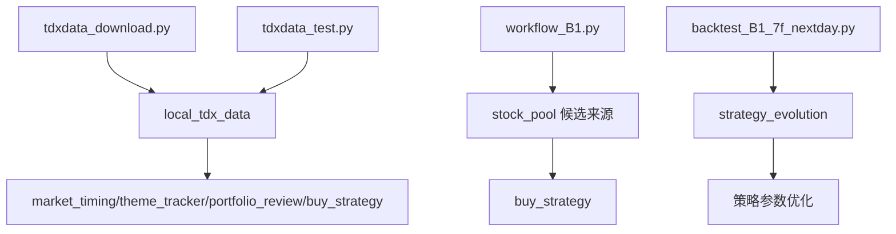

# C:\new_tdx64\PYPlugins\user 现有脚本评估

日期：2026-07-09

## 结论

该目录下已有一套可复用的本地通达信数据与选股研究脚本。

它们可以纳入 strategy_team，作为 `local_tdx_data` 和 `stock_pool` 的基础能力。

## 目录文件

| 文件 | 作用 | 可复用程度 |
|---|---|---|
| `tqcenter.py` | 通达信 TQ 核心接口 | 核心依赖 |
| `tdxdata_download.py` | 批量下载前复权日线 CSV | 高 |
| `tdxdata_test.py` | TQ 接口示例和接口说明 | 高 |
| `workflow_B1.py` | KDJ 候选 + 因子打分 + 相似度 Top10 | 中高 |
| `backtest_B1_7f_nextday.py` | B1 因子集次日回测 | 中 |
| `README.md` | 因子集合说明 | 中高 |
| `data.tar.gz` | 参考/数据包 | 待确认 |
| `B1_DATA/` | 参考股票数据 | 中 |
| `R_DATA/` | B1 输出结果 | 中 |

## 重点脚本说明

### 1. `tdxdata_download.py`

功能：

- 调用 TQ `get_market_data`
- 支持单只股票或全 A 股票池
- 下载日线 OHLCV + Amount
- 默认前复权
- 输出 CSV

已实测：

```bash
uv run python C:\new_tdx64\PYPlugins\user\tdxdata_download.py --code 600150.SH --start 20260701 --end 20260709 --out-dir C:\Users\gh\.openclaw-tdxclaw\workspace\strategy_team\01_data\local_tdx_test
```

输出成功：

`01_data/local_tdx_test/600150.SH-20260701-20260709.csv`

字段：

- Date
- Code
- Open
- High
- Low
- Close
- Volume
- Amount

可直接用于：

- 本地 K 线数据导出
- stock_pool 批量技术扫描
- buy_strategy 价格区间计算
- strategy_evolution 回测数据准备

建议：

- 不直接修改原脚本。
- 在 strategy_team 下封装调用，避免污染通达信 user 目录。

### 2. `tdxdata_test.py`

功能：TQ 接口示例库。

包含可用接口说明：

- `get_market_data`：K线
- `get_market_snapshot`：快照
- `get_stock_info`：基础财务
- `get_financial_data`：专业财务
- `get_gpjy_value`：股票交易数据
- `get_bkjy_value`：板块交易数据
- `get_scjy_value`：市场交易数据
- `get_stock_list`：股票池
- `get_sector_list`：板块列表
- `get_stock_list_in_sector`：板块成分股
- `get_user_sector`：用户自定义板块
- `send_user_block`：写入自定义/临时条件股
- `send_warn`：发送预警

价值：

- 这是本地数据层接口手册。
- 后续应按这个示例封装 `local_tdx_data.py`。

### 3. `workflow_B1.py`

功能：本地选股工作流雏形。

流程：

1. 从 TQ 获取股票池：`get_stock_list(pool_type)` 或 `get_stock_list_in_sector(pool_sector)`
2. 获取 OHLCV
3. 计算 KDJ J 值
4. 筛选 `J < 13` 的候选
5. 计算因子
6. 与参考股票做相似度
7. 输出 TopN

输出文件：

- `B1_kdj_candidates.csv`
- `B1_factor_zscores_*.csv`
- `B1_similarity_*.csv`
- `B1_top10_*.csv`

可用于：

- stock_pool 的一个候选来源
- “低位修复 + 因子相似度”子策略
- 后续回测和策略进化

注意：

- 当前逻辑偏技术/因子选股。
- 不能直接等同于买入信号。
- 必须经过 market_timing、theme_tracker、risk_control、chief_decision。
- 该脚本当前仅覆盖完整 B1 波段模型中的“J < 13 候选 + 因子相似度”部分，不包含宏观择时、主线/主题周期区分、结构止损、BBI 止盈和清仓逻辑。
- 完整基础模型以 `B1_SWING_STRATEGY.md` 为准。

### 4. `backtest_B1_7f_nextday.py`

功能：对 B1 factor-set 7 做次日回测。

可用于：

- 验证 B1 选股因子是否有效
- strategy_evolution 的因子评估

当前优先级：中等。先不急于接入每日流程。

## 与 strategy_team 的关系



## 建议接入方式

### 第一阶段：只封装，不改原脚本

在 strategy_team 下新增：

- `07_tools/local_tdx/local_tdx_data.py`
- `07_tools/local_tdx/run_tdx_download.py`
- `07_tools/local_tdx/run_b1_workflow.py`

作用：

- 统一调用原始脚本
- 统一输出到 strategy_team 的 `01_data/`
- 保留原脚本作为外部依赖

### 第二阶段：抽取核心函数

把以下能力迁移/封装：

- get_stock_list
- get_market_data
- get_market_snapshot
- get_stock_list_in_sector
- get_sector_list
- fetch_ohlcv
- B1 factor scoring

### 第三阶段：接入 stock_pool

将 B1 输出作为 stock_pool 的一个候选来源：

- 来源标签：`B1_low_j_factor_similarity`
- 默认进入 B池或观察池
- 只有当 market_timing 和 theme_tracker 支持时，才可能升级 A池

## 注意事项

1. 原脚本位于通达信安装目录，不建议直接大改。
2. `workflow_B1.py` 是选股候选来源，不是完整 B1 交易系统。
3. KDJ `J < 13` 只能触发 B1 候选，必须等待修复信号并通过完整许可链。
4. B1 结果必须服从：大盘、板块、风控、总控。
5. 输出应统一复制/生成到 `strategy_team/01_data/stock_pool/`，而不是长期依赖 `R_DATA/`。

## 当前建议优先级

1. 先建立 `local_tdx_data` 封装层。
2. 将 `tdxdata_download.py` 接入 strategy_team 数据目录。
3. 将 B1 workflow 作为 stock_pool 的候选来源之一。
4. 后续再一起完善选股逻辑和因子有效性。
