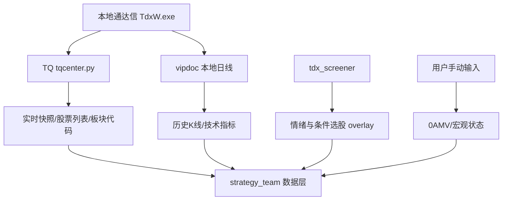

# 本地通达信数据源状态

日期：2026-07-09

## 结论

本机具备本地通达信数据能力。

当前不是单独的“local data MCP”形态，而是通过：

1. 本地通达信客户端 `TdxW.exe`
2. 本地 TQ 接口 `C:\new_tdx64\PYPlugins\user\tqcenter.py`
3. 本地日线文件 `C:\new_tdx64\vipdoc`
4. OpenClaw 脚本封装
5. 已下载历史 CSV 库 `E:\O_DATA`

共同形成本地数据源。

可将其视为策略 Team 的 `local_tdx_data` 数据层。

## 已验证环境

- 通达信客户端正在运行：`c:\new_tdx64\tdxw.exe`
- TQ 模块存在：`C:\new_tdx64\PYPlugins\user\tqcenter.py`
- 本地 vipdoc 存在：`C:\new_tdx64\vipdoc`
- TQ 初始化成功
- 已下载历史 CSV 库存在：`E:\O_DATA`

探针脚本：

- `07_tools/tdx_local_probe.py`
- `07_tools/tdx_local_probe2.py`

结果文件：

- `06_logs/tdx_local_probe_result.json`
- `06_logs/tdx_local_probe2_result.json`

## 关键运行约束

TQ 本地接口不适合多进程并发初始化。

原因：

- `tqcenter.py` 使用传入 path 作为策略唯一标识。
- 同一个策略标识并发运行会触发“已有同名策略运行”。
- 即使使用不同 PID 标识，也建议在 daily_pipeline 中串行访问 TQ，避免客户端连接拥塞。

当前处理：

- `local_tdx_data.py` 已给 TQ session path 加入 PID，降低同名冲突。
- 流水线设计上仍应串行调用本地 TQ。
- 可以并发读取本地 `vipdoc` 文件，因为不需要 TQ 连接。

## 当前可稳定获取的数据

### 1. 指数/股票 K 线

来源：TQ `get_market_data`、本地 `vipdoc`、历史 CSV 库 `E:\O_DATA`

已验证代码：

- `000001.SH` 上证指数
- `399006.SZ` 创业板指
- `000688.SH` 科创50
- `899050.BJ` 北证50
- `600150.SH` 中国船舶等个股

可用于：

- market_timing 指数趋势
- theme_tracker 板块/指数趋势
- portfolio_review 个股技术分析
- buy_strategy 买入价区间与止损位计算
- stock_pool 历史因子扫描
- strategy_evolution 回测

### 2. 实时/盘中快照

来源：TQ `get_market_snapshot(stock_code)`

已验证：

- 指数快照可取
- 个股快照可取

可返回字段包括：

- Now 当前价
- LastClose 昨收
- Open 开盘
- Max 最高
- Min 最低
- Amount 成交额
- Volume 成交量
- Inside / Outside 内外盘
- 买卖盘部分字段

可用于：

- 盘中 market_timing 快照
- 个股当前价与止损/突破判断
- 微信简版盘中摘要

### 3. A 股股票列表

来源：TQ `get_stock_list()`

已验证：

- 默认调用可返回约 5534 个股票代码

可用于：

- stock_pool 初始股票全集
- 本地批量技术扫描
- 风险过滤

注意：

- 带 market 参数的调用方式需要继续确认签名，目前默认全量可用。

### 4. 板块代码列表

来源：TQ `get_sector_list()`

已验证：

- 可返回约 588 个板块代码
- 返回主要是代码，如 `880xxx.SH`

可用于：

- theme_tracker 板块技术监控
- 后续板块代码映射

限制：

- 当前接口只返回板块代码，不直接返回板块名称。
- 板块名称映射仍需补充。

### 5. 板块成分股

来源：TQ `get_stock_list_in_sector(sector, block_type=0)`

已验证：

- `880081.SH` 可返回成分股

可用于：

- theme_tracker 板块成分股分析
- stock_pool 从强势板块扩展候选股
- 板块核心股/后排股识别

限制：

- 需要先解决板块代码与板块名称映射。

### 6. 已下载历史 CSV 库：`E:\O_DATA`

当前状态：已确认存在。

统计：

- CSV 文件数：5484
- 有效文件：5479
- 空文件：5
- 总大小：约 376MB
- 日期范围：2021-08-02 至 2026-02-06
- 字段：Date、Code、Open、High、Low、Close、Volume、Amount
- 文件名格式：`000001.SZ-all-latest.csv`

索引文件：

- `01_data/local_tdx/e_odata_index.json`
- `01_data/local_tdx/e_odata_index.csv`

用途：

- stock_pool 历史扫描
- B1 因子选股
- strategy_evolution 回测
- 作为 TQ/vipdoc 的历史缓存底座

限制：

- 数据截止到 2026-02-06，不是最新。
- 日常运行需要用 TQ/vipdoc 做增量更新。
- 部分北交所文件为空。

### 7. 本地 vipdoc 日线文件

来源：`C:\new_tdx64\vipdoc`

已用于：

- `technical_monitor.py`
- `batch_holding_technical.py`

优势：

- 不依赖实时 TQ 连接
- 可稳定读取历史日线
- 适合批量技术计算

已修复：

- 北交所代码识别，如 `920808` 正确识别为 `.BJ`

## 当前不稳定/暂不可用的数据

### 1. 0AMV 活跃市值

当前状态：用户手动输入。

原因：

- TQ `get_scjy_value` 当前只返回 `SC36: [['0.00', '0.00']]`
- 其他候选市场字段暂未返回有效结果

当前处理：

- 保留手动输入入口
- 规则已固定：
  - 当日涨幅 `> 4%`：做多区间
  - 当日跌幅 `> 2.3%`：空头区间

### 2. 涨停/跌停/炸板/连板高度

当前状态：可以通过 `tdx_screener` 手动 overlay，尚未完全脚本化。

已验证可用数据：

- 涨停数
- 跌停数
- 炸板数
- 炸板率
- 连板高度

下一步：

- 将 tdx_screener overlay 自动写入 market_timing 输入文件。

### 3. 个股行业/概念关系

当前状态：TQ 本地 `get_relation` 在本机 tqcenter 中不可用。

处理方式：

- 已改用 `tdx_indicator_select` 补齐持仓行业/概念/产业链。

下一步：

- 为 stock_pool 建立行业/概念缓存。

### 4. 板块名称映射

当前状态：有板块代码，无完整名称映射。

下一步：

- 建立 `01_data/sectors/sector_code_map.json`
- 优先补齐 AI算力、液冷、半导体、机器人、稀土、证券、军工、能源等重点方向。

## 建议的数据源架构

## 当前可执行方案

### market_timing

本地可自动：

- 四大指数 K 线趋势
- 四大指数盘中快照
- 外围市场另走 Yahoo 或其他接口

手动/半自动：

- 0AMV
- 涨跌停/炸板/连板 overlay

### theme_tracker

本地可自动：

- 板块代码列表
- 板块 K 线技术状态，前提是补齐板块代码映射

待补：

- 板块名称映射
- 重点板块清单

### portfolio_review

本地可自动：

- 持仓个股 K 线
- 技术状态
- 当前价快照

待补：

- 持仓同步自动化

### stock_pool

本地可自动：

- 股票全集
- 技术形态扫描
- 盘中快照

待补：

- 行业/概念映射缓存
- 主线板块到股票池映射
- tdx_screener 条件选股自动接入

## 当前接入进度

### 已完成

1. 已固化 `local_tdx_data` 工具层，统一封装 TQ + vipdoc + O_DATA。
2. `market_timing_collector.py` 已升级为 `market_timing_collector_v3_local_tdx`。
3. 市场择时采集已优先通过 `local_tdx_data` 获取：
   - 四大指数 vipdoc 日线趋势
   - 四大指数盘中快照
   - 市场候选快照
   - SC 字段原始返回
4. 已测试输出：
   - `01_data/market/2026-07-09_market_timing_input_localtdx_test.json`

### 仍需继续

1. 保留 0AMV 手动输入入口。
2. 自动化 tdx_screener 情绪 overlay。
3. 建立板块代码名称映射。
4. 将 theme_tracker/portfolio_review/stock_pool 逐步改为读取 `local_tdx_data`。

## 下一步优先级

1. 自动化 tdx_screener 情绪 overlay。
2. 建立板块代码名称映射。
3. 将 theme_tracker 接入 `local_tdx_data` 的板块列表与板块成分股。
4. 将 `workflow_B1.py` 接入 stock_pool 候选来源。
