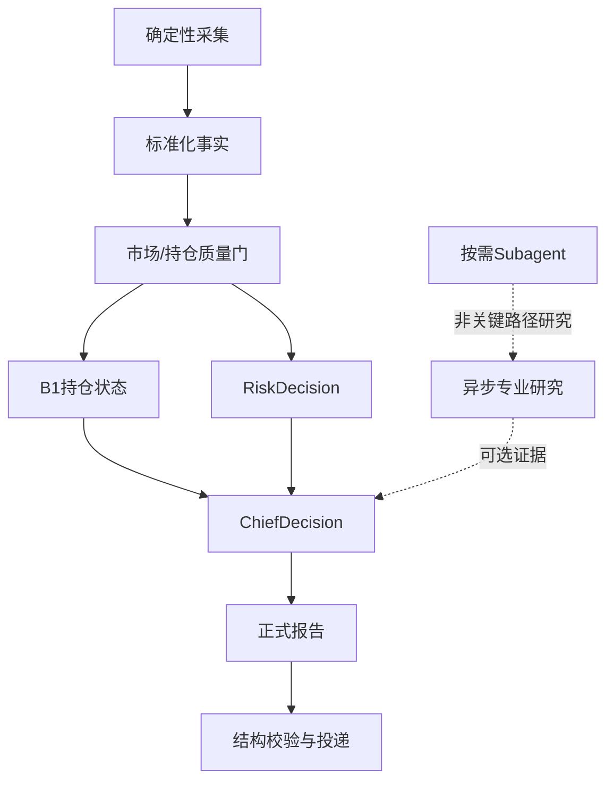

# 投资策略 Team 总工作流

日期：2026-07-09

> 2026-07-12 更新：面向用户的正式产出已收口为五类——盘前报告、14:45尾盘操作建议、最终盘后复盘、周日复盘、月度复盘。详细时点、输入输出和边界以 `REPORT_BLUEPRINT_V2.md` 为最新基线；本文保留内部 Agent 决策链。
>
> 2026-07-15生产架构调整：正式报告采用“确定性脚本主链 + 轻量单Agent调用/投递”。`market-intelligence`、`theme-sector`、`portfolio-execution`及临时Subagent只作异步研究增强，不进入09:05、14:45、15:15、20:30关键路径。缺失研究结果不阻断报告，也不得提高交易权限。

## 目标

建立一个持续进化的投资决策辅助系统，覆盖：

- 市场择时
- 产业/主线研究
- 板块判断
- 选股池
- 买入策略
- 持仓研判
- 卖出风控
- 总控决策
- 交易复盘与策略进化

核心原则：

> 大盘决定仓位，板块决定方向，个股决定执行，风控决定边界，总控决定最终动作。

## 生产总流程

原有角色定义继续作为逻辑职责和研究模板保留，但生产执行以脚本模块为准，不要求为每个角色启动独立Agent。

## 角色顺序

### 1. market_timing：市场许可层

回答：

- 今天市场能不能做？
- 总仓位应该是多少？
- 是否允许新开仓？
- 风控等级是多少？

输出给：所有后续 Agent。

### 2. industry_research：产业方向层

回答：

- 哪些产业长期值得跟踪？
- 哪些逻辑有政策、技术、需求、业绩支撑？
- 哪些方向只是短期噪音？

输出给：theme_tracker、stock_pool。

### 3. theme_tracker：主线/板块层

回答：

- 当前主线是什么？
- 板块处于主升、修复、分歧、震荡还是退潮？
- 哪些板块支持交易？
- 哪些方向要回避？

输出给：stock_pool、portfolio_review、risk_control、chief_decision。

### 4. stock_pool：选股层

回答：

- 哪些股票值得进入候选池？
- 是 A池、B池、C池还是 D池？
- 入池理由和风险点是什么？

输出给：buy_strategy、chief_decision。

### 5. buy_strategy：买入计划层

回答：

- 候选股满足什么条件才可以买？
- 买入价区间在哪里？
- 首仓比例是多少？
- 加仓条件是什么？
- 无效条件和止损位在哪里？

输出给：risk_control、chief_decision。

### 6. portfolio_review：持仓处理层

回答：

- 当前持仓继续持有、观察、减仓、止损还是清仓？
- 哪些持仓弱于板块？
- 哪些持仓触发风控？

输出给：risk_control、chief_decision。

### 7. risk_control：纪律否决层

回答：

- 哪些动作禁止？
- 哪些股票需要减仓/止损/清仓？
- 哪些方向进入冷却？
- 买入计划是否有风控漏洞？

输出给：chief_decision。

### 8. chief_decision：总控执行层

回答：

- 今天最终做什么？
- 哪些动作允许？
- 哪些动作禁止？
- 仓位如何安排？
- 明天验证什么？

输出：每日交易计划。

### 9. strategy_evolution：复盘进化层

回答：

- 计划是否被执行？
- 规则是否有效？
- 哪些错误重复出现？
- 哪些参数需要调整？

输出：策略版本更新建议。

## 每日运行节奏

### 盘前

1. 更新市场择时数据。
2. 更新主线/板块状态。
3. 更新持仓技术状态和风险状态。
4. 生成 stock_pool 候选池。
5. 生成 buy_strategy 条件化买入计划。
6. risk_control 审核买入/持仓动作。
7. chief_decision 输出每日交易计划。

### 盘中

- 只执行计划内动作。
- 计划外机会必须记录触发原因，并经总控规则确认。
- 禁止无计划追涨、摊低、临时冲动交易。

### 收盘后

1. 记录实际执行。
2. 对比计划与结果。
3. 标记是否违反规则。
4. 更新次日观察点。
5. 进入复盘与策略进化。

## 内部决策输出与正式报告

下列内容是内部决策链必须形成的要素，不再要求分别推送成独立报告。它们按时点汇总进入盘前、14:45和盘后正式报告：

- 市场状态
- 建议总仓位
- 新开仓权限
- 主线/板块状态
- A/B/C/D 候选池
- 买入计划
- 持仓处理建议
- 风控禁止动作
- 今日最终交易计划
- 明日验证点

## 硬约束

1. 风控优先于买入。
2. 大盘约束优先于板块机会。
3. 板块状态优先于个股信号。
4. stock_pool 不等于买入清单。
5. buy_strategy 不绕过 stock_pool。
6. risk_control 拥有否决权。
7. chief_decision 是最终输出层。
8. 所有交易计划必须可复盘。
