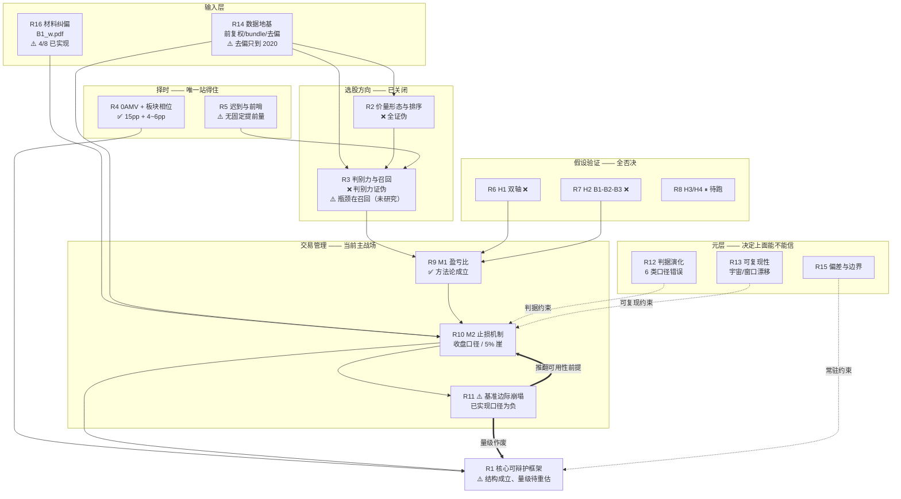

# B1 研究单元索引与主图

> 目的：沉淀 B1（J<13 反转买点）系统性回测的**结论、框架形态、偏差警示、工具用法**，
> 防止后续重复踩坑或误把有偏结果当实盘预期。
> **所有内容为研究结论，未改动任何线上买入逻辑。**
>
> 2026-08-06 由单文件 `B1_BACKTEST_FINDINGS.md`（2456 行、按时间追加）拆成 17 个研究单元。
> 拆分理由：同一主题的结论散落在十几处，而**后面的常常推翻前面的** ——
> 按时间读会先读到已被作废的数字。原文见 git 历史。

## 主图：研究单元之间的关系

**读图要点**：粗箭头（`==>`）是**推翻关系**。R11 是目前最新、也最具破坏性的一环——
它不否定 R10 的相对判定，但把「相对改善之上有可用策略」这个前提抽掉了。

## 证据等级

| 等级 | 含义 |
|---|---|
| **L4** | 跨年 walk-forward + **含退市宇宙** + 净值对照；或口径错误这类可证明的事实 |
| **L3** | 跨 seed / 跨区间方向一致，但宇宙**带幸存者偏差** |
| **L2** | 单一区间或样本内多重比较，**未 OOS** |
| **L1** | 合成数据 / 单案例 / 仅逻辑推演 / 材料转述 |
| **L0** | 已实现但**未跑** |

⚠️ **L3 及以下的结论不得进入 live 逻辑。** 教训来自 R2：`reversal_quality_inv`
样本内大胜 +69.4%，含退市跨年验证翻转为 −11.9%。

## 总账

| 单元 | 主题 | 结论 | 等级 | 状态 |
|---|---|---|---|---|
| [R1](R1_core_framework.md) | 核心可辩护框架 | 0AMV + 反转K + 带空间止损 + BBI + 分散 | L3 | ⚠️ 结构成立、**量级待重估** |
| [R2](R2_selection_price_volume.md) | 价量形态与排序 | 随机/等权 ≥ 一切价量选择器 | L4 | ❌ 证伪（章节关闭）|
| [R3](R3_selection_discriminability_recall.md) | 判别力与召回 | 无跨窗共同点；**瓶颈在召回** | L4 | ❌ / ⚠️ 未研究 |
| [R4](R4_timing_amv_sector.md) | 0AMV + 板块相位 | 0AMV ~15pp（三熊窗重取）；板块方向不稳（降级）| L4 / 降级 | ✅ 0AMV 成立（2026-08-09 重取）|
| [R5](R5_timing_lateness_sentinel.md) | 迟到与前哨 | 无可机械化的提前量（0→53 天）| L3 | ⚠️ 可利用性未证 |
| [R6](R6_hypothesis_H1_dual_axis.md) | 假设 H1 双轴 | 未过跨窗终审 | L3 | ❌ 否决 |
| [R7](R7_hypothesis_H2_b1b2b3.md) | 假设 H2 B1-B2-B3 | 全否决（regime 过拟合）| L3 | ❌ 否决 |
| [R8](R8_hypothesis_H3_H4_pending.md) | 假设 H3/H4 | 无结论 | L0 | ⏸ **待跑** |
| [R9](R9_method_M1_payoff_ratio.md) | M1 盈亏比 | 胜率不是该优化的变量 | L3/L2 | ✅ 方法论 / ⚠️ 落地待重验 |
| [R10](R10_mechanism_M2_stops.md) | M2 止损机制 | 收盘口径最大改进；5% 是崖 | L2 | 🔄 **前提被 R11 推翻** |
| [R11](R11_baseline_margin_collapse.md) | ⚠️ 基准崩塌 | **已实现口径 3000 样本为负** | L3 | ⚠️ 成立 |
| [R12](R12_meta_criteria_evolution.md) | 判据演化 | 6 类口径错误已修 | L4 | ✅ 已修 |
| [R13](R13_meta_reproducibility.md) | 可复现性 | 宇宙与窗口在漂移 | L4 | ⚠️ 开关默认关 |
| [R14](R14_meta_data_foundation.md) | 数据地基 | 前复权已对账；**去偏只到 2020** | L4 | ⚠️ 有硬限制 |
| [R15](R15_meta_bias_and_limits.md) | 偏差与边界 | 六类偏差 + PIT/市值特性 | L4 | ✅ 常驻 |
| [R16](R16_input_material_corrections.md) | 材料纠偏 | 8 条，4 已实现 | L1 | ⚠️ 待排优先级 |
| [R17](R17_infra_tooling.md) | 工程与规范 | 瓶颈是评估不是加载 | L4 | ✅ |

## 当前一句话结论

**结构上**：`0AMV择时 + 反转K入场 + 带空间止损（≥5%，别更紧）+ BBI移动止盈 + 分散多槽`
是目前唯一可辩护的组合；**edge 来自择时 + 分散 + 交易管理，不是选股**。

**量级上**：⚠️ **不知道。** 3000 样本下已实现口径为负期望（R11），
而这个数字**还带幸存者偏差**（R14：2021 后无退市数据）。
在 R11 的问题解决前，任何 CAGR/期望数字都不应被引用。

## 下一轮入口（按优先级）

1. **R11 的问题先解决** —— 换个提法：不问「能提升多少」，而问
   「有没有方案能在 3000 只宇宙里做出 >3pp margin」。跨组表前三名的 amv 系是唯一候选。
2. **R3 的召回瓶颈** —— 拆「大牛股在起涨前长什么样、被哪一条门槛挡掉」
   （反向排查 j_low/缩量/振幅各条件的召回损失），而**不是**再造排序特征。
3. **R8 待跑**（H3 RSI / H4 主升始发点），但必须先过跨区间。
4. **R14 的去偏能力** —— 需要退市股历史行情源才能覆盖 2021 后窗口。

### 从原 §5 承接的收尾项

- **【已完成】「空头段识别未来赢家」12 窗研究（2026-07-31）**：结论**证伪**，无跨窗共同点（见 R3）。
  剩两个收尾项（工具均已就绪，待在有 qlib 数据的机器上跑）：
  ① `--survivorship-report` 看「零收益中已摘牌」列，确认 `--exclude-zero-ret` 有没有删掉真飞刀
  （交集 >0 就得改口径重跑一次）；② `--zero-ret-report` 按 volume 查明 2022 年后僵尸样本成因。
  两条都是纯读 firings + 按需重载，不重跑 Pass1。
- **【已完成】跨年份真样本外验证（2026-07-28）**：7 窗口 walk-forward（含退市股宇宙）
  结论**选丑反转证伪**（见 R2）。后续若再做选股研究，一律以 `--universe-sdata` 含退市宇宙
  + 跨年份窗口为准入门槛，**样本内 train/test 不再接受为证据**。
- **全市场 OOM**：流式 + cap + summary-only 已缓解；`--top-n`(collect_all) 大样本仍重，
  彻底解需「只模拟被选中交易」或向量化（见 R17）。
- **归因**：可加「交易收益对基准回归求 alpha/beta」，判断收益是 alpha 还是小盘/牛市 beta。

## 跨窗终审总账（2026-08-03）

本轮（H1 双轴/共振/QSX 周线、H2 B2/底部异动全部口径）**无一通过跨窗终审**，
死法相同：**edge 集中在 2025-2026 单一 regime**。再次印证「瓶颈在召回不在排序」，
且任何「更严的入场条件」都要先过跨区间这一关。
**b1_dual 系与 B2/异动系全部不接入选股链。**

## 旧编号对照表

拆分前正文里用「结论#N」「§N」互相引用，**这些编号在新结构里已无对应章节**。
各单元的证据段仍保留原文措辞（不改历史留痕），按此表换算：

| 旧编号 | 内容 | 现在在哪 |
|---|---|---|
| 结论#1 #2 | 形态无 alpha / 完美B1指纹有害 | [R2](R2_selection_price_volume.md) |
| 结论#3 | edge 出现在交易管理 | [R1](R1_core_framework.md) |
| 结论#4 | 0AMV 做多择时有价值 | [R4](R4_timing_amv_sector.md) |
| 结论#5 #6 #7 | J<13 单用 / 反转K / 杠杆在容量分散 | [R1](R1_core_framework.md) |
| 结论#8 | 横截面择优全证伪（含选丑翻转）| [R2](R2_selection_price_volume.md) |
| 结论#10 | 板块相位择时 | [R4](R4_timing_amv_sector.md) |
| 结论#11 | 0AMV 入场择时「迟到」 | [R5](R5_timing_lateness_sentinel.md) |
| 结论#12 #13 #14 | 捕捉率 / 判别力 / 空头段识别赢家 | [R3](R3_selection_discriminability_recall.md) |
| **结论#15** | 平台突破回踩形态 | [R2](R2_selection_price_volume.md) |
| §1 工具 | 回测器开关全集 | [R17](R17_infra_tooling.md) |
| §2 关键结论 | 已按主题拆入 R1–R5 | 见上 |
| **§3 偏差警示** | 六类偏差 + PIT/市值特性 | [R15](R15_meta_bias_and_limits.md) |
| §4 最佳配置 | 有偏上界 | [R1](R1_core_framework.md) |
| §5 未决 | 收尾项与下一轮入口 | 本文件「下一轮入口」 |
| §6 非目标 | 研究边界 | [R15](R15_meta_bias_and_limits.md) |

⚠️ **一处必须说清的错位**：原文把 12 窗研究的**四条实证**（召回率单调下降等）
物理上嵌在 `结论#15`（平台突破回踩）的列表项之下——而它们其实属于 `结论#14` 的 12 窗研究。
所以：

- 单独出现的 **`结论#15`** = 平台突破回踩形态 → [R2](R2_selection_price_volume.md)
- **`结论#15 实证第 N 条`** = 12 窗研究的实证 → [R3](R3_selection_discriminability_recall.md)

后者在 R6/R7/R9 里共 6 处引用。**原文的引用是自洽的**（与它当时的嵌套一致），
错的是嵌套位置；拆分时已把四条实证归到 R3，正文措辞保留不改。

## ⚠️ 重跑清单（2026-08-06 排查）

数据层 review 查出三件事，波及已有结论。**优先级按「live 是否正在依赖它」排**：

| 优先级 | 单元 | 不稳的是什么 | 方向会变吗 |
|---|---|---|---|
| ~~**P0**~~ ✅ | [R4](R4_timing_amv_sector.md) 0AMV+板块 | **2026-08-09 重跑完成**（16 格 2×2 × 4 窗）：0AMV ~15pp 主过滤器地位三熊窗（含两个含退市老窗）重取；板块相位「+4~6pp 辅助」**未通过**（四窗两正两负），降级为方向不稳 | 0AMV 方向不变，资格已重取；板块结论被推翻 |
| **P1** | [R2](R2_selection_price_volume.md) 选股证伪 | 决定性翻转（+69.4%→−11.9%）**同时换了两个变量**（宇宙 + 数据源）⇒ 归因未分离；四条独立证据线的净值窗**全在被弃用 bundle 上** | **结论不变** —— 老 bundle 四个窗（乘法、真含退市）已独立支持；降的是**证据强度** |
| **P1** | [R10](R10_mechanism_M2_stops.md) 止损机制 | 基准盘几乎为零（R11）⇒ 相对改善之上没有可用策略。数据源是 tdx，**不受 bundle 影响** | 相对判定有效，**可用性结论作废** |
| **P1** | [R9](R9_method_M1_payoff_ratio.md) 分批止盈 | 落地数字验证于**旧止损口径**（p=18%），改收盘后 p=29.8% ⇒ `∂E/∂b = p` 方向不确定 | **方法论不用重跑**（那是算术）；落地数字要重验 |
| **P1** | [R1](R1_core_framework.md) 核心框架 | 「per-trade 正 edge」的**量级依据**继承 R10/R11 ⇒ 已实现口径为负，且还带幸存者偏差 | **结构不用重跑**；量级重取前**任何 CAGR/期望数字都不应被引用** |
| **P2** | [R3](R3_selection_discriminability_recall.md) 判别力与召回 | 12 窗里落在 2021-08 之后的窗数字被放大 | 多窗一致性支撑方向；但「≥100% 带 −37.5%」这个被反复引用的数字要重算 |

**未受影响**：R6/R7（用 `--universe-local` 走 tdx）、R12/R13/R15/R17（口径与工程事实）、
R14/R16（本身就是这轮的产出）。

### 三个根因

1. **qlib `2021_2026` bundle 是加法调整**（`raw − qlib` 分段常数，段差 = 每股现金分红）
   ⇒ 百分比收益放大 13~21%。已弃用，见 [`../data/QLIB_LOCAL_DATA.md`](../data/QLIB_LOCAL_DATA.md)。
2. **2021 年后退市的票一只都没有** ⇒ 近期窗口**无法去幸存者偏差**。
   老 bundle 的 214 只退市票只覆盖 1999-2020。
3. **基准边际随样本量崩塌**（R11）⇒ 相对判定的基准盘几乎为零。

### 一条方法论教训

R2 那次翻转**同时换了宇宙和数据源**。当时把翻转全部归因于幸存者偏差，
而现在已知另一个变量（加法调整）也会显著改变收益 ⇒ **归因不成立**。
⇒ **对照实验一次只换一个变量**；换两个就只能得到「有变化」，得不到「因为什么」。

## 写入规范

- 一个单元 = 一个**研究问题**。新结论追加到对应单元的「证据与过程」里，
  并**同步更新单元头部的「结论」与「状态」** —— 头部是给人读的当前状态，正文是过程留痕。
- 结论被推翻时**不要删除旧结论**，标 🔄 并写清被什么推翻（见 R10 的写法）。
- 每条结论必须带**证据等级**。拿不出等级的，说明它还是猜测。
- 新开研究方向再建单元，编号只增不复用。
