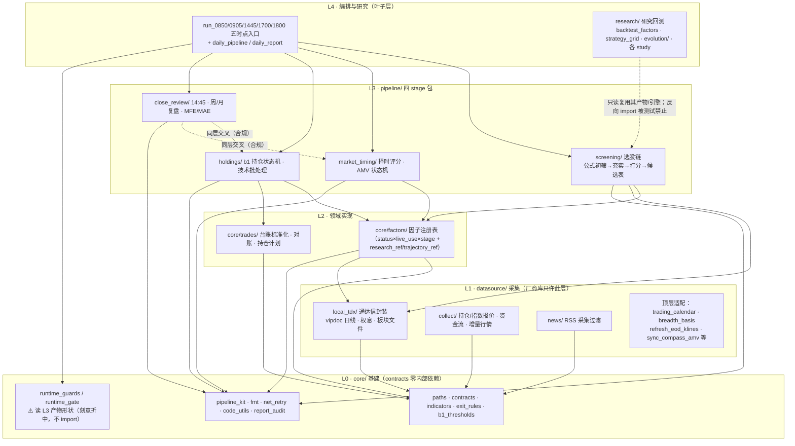

# AGENTS.md — Custos 协作共享认知

> 给所有在本仓库工作的 agent（含多机并行）的**最小必读**。只记两类东西：
> ① 不读代码就不知道、且**靠测试强制**的隐形纪律；② 快速定位的地图。
> 细节一律指向各目录 README/治理文档，本文件不复述（防漂移）。
> **改了本文件描述的行为时，必须同步更新本文件。**

## 0. 项目定位与核心原则

确定性脚本驱动的 A 股交易策略系统（择时/选股/持仓研判/卖出风控/总控决策/复盘）。

**核心原则：数据采集和因子计算全部由 Python 脚本完成，LLM 参与数据和消息分析、
市场信息判断、因子研究。** LLM 不进 live 交易决策与执行链路（live 零 LLM）。

核心思想：不追求胜率，追求盈亏比；杠杆加在出场与仓位管理（`README.md`、
`governance/strategy/_shared/system_principles.md`）。

## 1. 目录地图

| 路径 | 是什么 |
|---|---|
| `src/custos/core/` | L0 基建（paths/contracts/indicators/exit_rules）+ L2 因子/交易台账 |
| `src/custos/datasource/` | L1 数据采集（含 `local_tdx/` 本地通达信封装，文件解析器已下沉于此） |
| `src/custos/pipeline/` | L3 四个 stage 包 + L4 五时点 runner（run_0850/0905/1445/1700/1800） |
| `src/custos/research/` | L4 研究回测（只读管线数据，**生产永不 import 研究**，测试强制） |
| `src/custos/research/evolution/` | LLM 因子进化引擎（研究侧） |
| `governance/contracts` | 代码真读的 JSON 配置（EXIT_RULES 等）+ 工作流文档 |
| `governance/strategy` | 策略规则文档（一策略一目录 + STRATEGY_REGISTRY.json 强制登记） |
| `governance/research` | 研究单元 R1-R34（判据预注册，编号只增不复用） |
| `TODO.md` / `CHANGELOG.md` | 待办 vs 已改策略规则，两者分工严格（见 §4） |
| `tests/` | ~6100 测试，架构/契约/注册表全靠它强制 |

## 2. 架构分层（AST 测试强制：`tests/test_architecture_layers.py`）



因子包内部互赖（同层合法，注册表测试核对）：`b1_dual_factor → s_shape /
platform_pullback`、`main_rally_factor → rsi_state`、`sector_phase →
sector_mainstream`。

L0→L4 单向依赖，下层不得依赖上层；contracts.py **零内部依赖**（只许 stdlib）。
厂商库（mootdx/akshare/qlib/tqcenter…）只许 `datasource/` import（白名单钉测，
豁免集保持为空）。新增按日期命名的 JSON 产物必须在 `core/contracts.py` 建
schema 并在生产者落盘前 `require()`（豁免要登记理由），否则测试红。

两个语义注记（测试管不到、图上已标）：① `runtime_guards.py`（L0）读 L3 产物
形状——"守卫知道被守卫对象的 schema"是刻意折中；② L3 四包不是互相隔离的，
同层互 import 合法且已发生（见图注）。


## 3. 命令与环境

```bash
uv run pytest -q          # 全量（~10.6 分钟/6124 例，2026-09-21 实测；提交前必跑且必须全绿）
bash scripts/audit.sh     # 六件套；第 0 件 ruff format --check 是唯一硬门槛
uv run --with mypy mypy --config-file scripts/mypy.linux.ini src/
```

- Python ≥3.11，依赖只有 pandas/mootdx/openpyxl/requests——**不得新增第三方依赖**
  （向量化用 numpy 等 pandas 自带物；DSL 解析用 stdlib ast，**禁止 eval/exec**）。
- 本机（dev）**无网络、无通达信数据**：测试一律合成数据注入（loader=/monkeypatch），
  conftest 已 block 部分网络。真实数据跑数在生产机。

## 4. 治理纪律（全部有测试钉着，违反必红）

**TODO.md**：
- 完成的项**直接删**，禁止 `~~删除线~~`（`test_no_strikethrough_entries`）；
- 新增必须带出处；编号只增——**改前先 pull**（多机并行撞过号）。

**CHANGELOG.md**：
- 每行 ≤400 字符（`test_row_length_cap`，多人踩过）；版本号只增不复用；
- 记「已改的策略规则」，不记待办。

**研究单元**（`governance/research/`，`test_research_units.py`）：
- 判据跑数前写死（`R{n}-C{i}`）；结论被推翻标 🔄 不删除；每结论带证据等级；
- **双窗纪律**：寻优全程不得读判定窗；**pre2019（2010-2016）untouched 终审段
  任何挖掘/判定不得相交**（工具硬拒绝）；
- 单元头部「状态/结论」必须与正文同步（R22 头部滞后是反面教材）。

**因子注册表**（`core/factors/`，`test_factor_registry.py`）：
- 元数据三维：status（证据）× live_use（允许怎么用）× stage（是否在跑）；
- 谱系字段 `research_ref`（R 文档须存在）/`trajectory_ref`（`t_xxxxxxxxxx`）；
- 准入：`free_params≥4` 且 active ⇒ 必须有 research_ref；evidence_only 集合钉死；
- 接口已收敛（#67）：规范入口 `detect(df, code, ctx=)` / `score()`，live 标注与
  研究 SCORERS 同源（改判定语义=语义变更，须立项+回测）。

## 5. 研究层与进化引擎约定

- 新工具：写 `research/xxx.py`（`add_argument` **全留本文件**，`_modes()` 用 AST
  抽取）+ `research/__main__.py` TOOLS 登记；入口 stdout/stderr reconfigure utf-8；
- **空结果护栏**：0 数据/0 结果 → 非零退出且不写产物（防误读为"无有效因子"）；
- 研究产物 JSON **允许 NaN**（区别于生产侧 `paths.write_json` 的 allow_nan=False），
  落 `artifacts/logs/`；研究产物不建 contracts schema；
- 回测窗参数 `--start/--end/--count`：`--count` 是"最新向前 N 根"，早窗口必须显式
  加大（尾部截断护栏 fail-closed）；
- 进化引擎：LLM 只做提案（假设/变异/杂交/解读），**decision 由确定性函数给出**；
  挖掘/判定双窗硬隔离；`--joint`/`--grid-judge` 必须显式 `--count`；`--cell-top-n`
  默认 20（=0 是因子轴退化，scorer 不写交易集）。指标门 `--ic-gate`（rank 默认 /
  top_tail 头部价差 / off）+ 门次序 `--gate-order`（ic_first 默认 / marks_first
  成本控制）——非默认口径须已在研究单元预注册（R36 三轮是首个用例）。
  score_evolution_study 终审姿态：`--v0-lattice` 调权格（P3 族）/ `--addon-leg`
  骨架加腿（R36 思路二——新腿一律问「加进 V0 等权骨架的 Δmargin」，不问单独立）。
- 因子 IC 画像（`factor_ic_profile`）：SCORERS/DSL 的截面 RankIC/ICIR + horizon
  衰减全因子可比表——**分诊镜不是晋级判据**（晋级永远走双窗+三轴交易语义；
  读数 L3− 带幸存者偏差，R19/R21/R14）。
- 指标盘缓存（`research/indicator_cache.py`，`backtest_factors --indicator-cache`
  开启）：研究专用逐股电池复用——**红线：不得服务 live、不得服务 as-of 重播种
  路径**（score_return_study 判例）；指标实现任何改动必须 bump
  `INDICATOR_PACK_VERSION`（不改=旧缓存被当新实现读）。

## 6. 多 agent / 多机协作纪律

1. **开工先 pull**；完成立即 commit + push（版本号顺增，批间可 revert）；
2. TODO/CHANGELOG 是单写者文件：改前 pull，编号冲突时后手避让顺增；
3. 改行为必同步：对应 README/治理文档/AGENTS.md 三处至少检视一遍；
4. 文档与代码不一致时**以代码为准**（文档会漂移；schema/注册表在代码里）；
5. 发现旧文档行动项已被推翻：移到 TODO「已失效」表并写原因，不静默删除。

## 7. 快速定位

- 核心原则与架构：`README.md`；src 层细则：`src/custos/README.md`
- 研究索引/双窗/LLM 口径：`governance/research/README.md`（写入规范段）
- 因子接口收敛设计：`governance/strategy/_factors/interface_unification_plan.md`
- 进化引擎入口：`python -m custos.research evolution --help`（README 有冒烟命令）
- 实盘教训台账：`TRADE_LESSONS.md`（只增不删）
