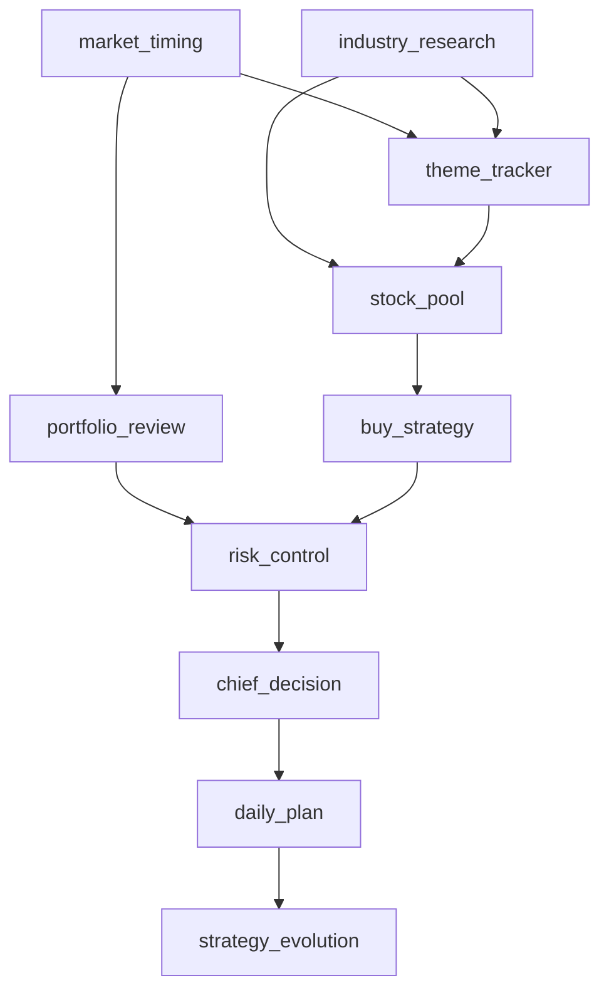

# strategy_team

持续进化的投资策略 Team。

## 核心目标

辅助完成：

- 市场择时
- 产业研究
- 主线/板块判断
- 选股池
- 买入计划
- 持仓研判
- 卖出风控
- 总控决策
- 交易复盘与策略进化

## 当前工作流

## 目录

- `00_governance`：总规则、工作流、角色边界、数据契约
- `01_data`：市场、板块、持仓、候选池等数据
- `02_agents`：各 Agent 角色说明、模板、数据结构
- `03_daily_plans`：每日交易计划和微信摘要
- `04_reviews`：日/周/月复盘
- `05_strategy_versions`：策略版本记录
- `06_logs`：流水线运行日志
- `07_tools`：采集、分析、生成报告脚本

## 当前阶段

Phase 1.5：框架基本完整，正在补数据源和自动化稳定性。

## 关键规则

1. 个股服从板块，板块服从大盘。
2. 风控优先于买入。
3. stock_pool 负责选股，buy_strategy 负责买入计划。
4. risk_control 拥有否决权。
5. chief_decision 是最终交易计划输出层。
6. 所有计划必须可复盘。
