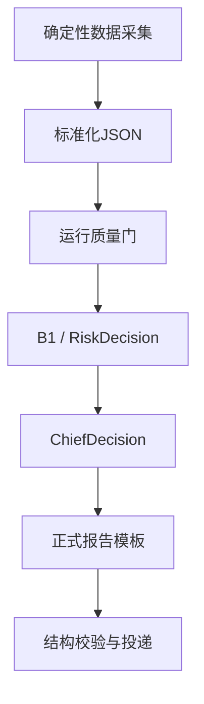

# strategy_team

确定性脚本驱动的 A 股交易策略系统。

## 项目定位

辅助完成市场择时、产业研究、主线/板块判断、选股池、买入计划、持仓研判、卖出风控、总控决策、交易复盘与策略进化。

**核心原则：数据采集与分析判断用确定性脚本，LLM 仅负责格式化和输出摘要。** 所有数据收集和指标计算由 Python 脚本完成，LLM 不参与策略判断。

## 快速开始

### 环境要求

- Python 3.11+（推荐通过 [uv](https://github.com/astral-sh/uv) 管理）
- 通达信客户端（本地日线数据源）
- mootdx（Python 库，数据访问层）

### 安装

```bash
git clone <repo-url> strategy_team
cd strategy_team

# 安装依赖
uv sync
# 或手动: uv pip install mootdx pandas requests

# 如果使用 OpenClaw 作为运行时
# 确保 openclaw.json 中 agents.defaults.workspace 指向本项目目录
```

### 配置

1. **通达信路径**：设置环境变量 `TDX_ROOT` 指向通达信安装目录（默认 `E:\new_tdx64`），脚本通过 `os.environ.get("TDX_ROOT", ...)` 读取

2. **持仓数据**：在 `01_data/trades/` 下维护：
   - `master_trade_ledger.csv` — 全量交易主台账
   - `current_positions.json` — 当前持仓快照
   - `_import_meta.json` — 交易日无交易确认标记

3. **交易日历**：`00_governance/CN_TRADING_CALENDAR.json` 包含年度休市安排，可通过 `trading_calendar.py --check-date YYYYMMDD` 查询

4. **RSS 源**：`00_governance/RSS_SOURCE_REGISTRY.json` 定义新闻源，`RSS_FILTER_CONFIG.json` 定义过滤规则

## 目录结构

```
strategy_team/
├── 00_governance/          # 策略规则、工作流、日历、RSS 配置
│   ├── b1_swing_strategy.md        # B1 波段策略主文件
│   ├── BUY_STRATEGY_INTEGRATION_RULES.md
│   ├── CN_TRADING_CALENDAR.json     # 交易日历
│   ├── DECISION_PRIORITY_RULES.md
│   ├── RSS_SOURCE_REGISTRY.json
│   └── ...
├── 01_data/                # 运行时数据（gitignore）
│   ├── holdings/                    # 持仓技术分析
│   ├── market/                      # 行情、市场择时输入
│   ├── news/                        # RSS 新闻
│   ├── quality/                     # 运行门控
│   ├── screening/                   # 选股链中间产物（公式命中、充实候选）
│   ├── stock_pool/                  # 选股链分层输出（StockPool 契约）
│   ├── trades/                      # 交易台账、持仓快照
│   └── ...
├── 02_agents/              # [已废弃] 纯脚本驱动不再需要多角色 Agent 规格（编号不复用，目录已删）
├── 03_daily_plans/         # 盘前日报、14:45 报告（gitignore，运行时生成）
├── 04_reviews/             # 盘后复盘
├── 05_strategy_versions/   # 策略版本记录
├── 06_logs/                # 运行日志（gitignore，运行时创建）
├── 07_tools/               # 全部脚本
│   ├── run_0850.py                  # 08:50 盘前预采集
│   ├── run_0905.py                  # 09:05 盘前日报
│   ├── run_1445.py                  # 14:45 尾盘操作建议
│   ├── run_1700.py                  # 17:00 盘后复盘
│   ├── run_1800.py                  # 18:00 每日选股（独立链）
│   ├── daily_pipeline.py            # 通用管线
│   ├── generate_risk_and_sectors.py # risk_decision + sector_state 生成
│   ├── collect_holding_quotes.py    # 持仓行情采集（mootdx）
│   ├── collect_incremental_market.py # 增量市场数据
│   ├── collect_fund_flow.py         # 资金流向（东方财富）
│   ├── calc_mfe_mae.py              # MFE/MAE 计算
│   ├── trading_calendar.py          # 交易日历查询
│   ├── runtime_gate.py              # 运行门控
│   ├── close_review/                # 尾盘+盘后复盘
│   ├── market_timing/               # 市场择时、B1 状态
│   ├── news/                        # RSS 采集与过滤
│   ├── screening/                   # 每日选股链（公式初筛→充实→打分→表格）
│   ├── trades/                      # 交易台账维护
│   └── local_tdx/                   # mootdx 封装
└── tests/                  # 独立测试目录（pytest）
    ├── conftest.py                  # sys.path + 导入设置
    ├── test_base_path_depth.py      # BASE 路径深度防回归
    ├── test_b1_holding_state.py     # B1 持仓状态
    ├── test_close_review.py         # 尾盘复盘
    ├── test_final_review_validator.py # 复盘校验器
    ├── test_holding_structure.py    # 持仓结构
    ├── test_review_enrichment.py    # 复盘增补
    ├── test_rss_filter.py           # RSS 过滤
    ├── test_runtime_guards.py       # 运行门控
    ├── test_technical_monitor.py    # 技术监控
    └── test_trading_calendar.py     # 交易日历
```

## 日常运行

交易日四个时点自动触发（通过 OpenClaw cron 或手动执行）：

| 时间 | 脚本 | 说明 |
|---|---|---|
| 08:50 | `run_0850.py` | 交易日历检查 → 公告/海外行情/RSS 采集 → 增量市场数据 |
| 09:05 | `run_0905.py` | 交易日历检查 → daily_pipeline(premarket) → 日报摘要 |
| 14:45 | `run_1445.py` | 交易日历检查 → 持仓行情采集 → 运行门控 → close_review → 尾盘建议 |
| 17:00 | `run_1700.py` | 交易日历检查 → 持仓收盘行情 → 增量市场数据 → MFE/MAE → 资金流向 → daily_pipeline(postclose) → final_close_review → 验证 |
| 18:00 | `run_1800.py` | 每日选股独立链（与三份报告分离）：公式初筛 → 模式识别 → 共振打分 → 备选表格；消费 17:00 链产出的当日 sector_state/risk_decision |

### 手动执行

```bash
# 查询是否交易日
uv run python 07_tools/trading_calendar.py --check-date 20260717

# 盘前日报
uv run python 07_tools/run_0905.py

# 14:45 尾盘建议
uv run python 07_tools/run_1445.py

# 17:00 盘后复盘
uv run python 07_tools/run_1700.py

# 18:00 每日选股
uv run python 07_tools/run_1800.py
```

## 数据源

| 数据 | 来源 | 工具 |
|---|---|---|
| A 股日线 | mootdx Reader（本地 .day 文件） | `local_tdx_data.py` |
| 实时行情 | mootdx Quotes（在线 bars） | `collect_holding_quotes.py` |
| 指数行情 | mootdx Reader / online index | `collect_holding_quotes.py` |
| 市场宽度（880系列） | mootdx Reader | `collect_incremental_market.py` |
| 财务数据 | mootdx Affair | `local_tdx_data.py` |
| 复权因子 | mootdx get_adjust_year | `local_tdx_data.py` |
| A50/汇率 | Yahoo Finance | `collect_incremental_market.py` |
| 资金流向 | 东方财富 push2 API | `collect_fund_flow.py` |
| 北交所行情 | 东方财富 push2 API（mootdx 不支持 BJ） | `collect_holding_quotes.py` |
| 公告 | wenda_notice_query | cron LLM 调用 |
| 新闻 | RSS | `rss_collector.py` |
| TQ 选股公式批量筛选 | TQ-Local（formula_process_mul_xg，需 TdxW 运行） | `screening/formula_screen.py` |

## 策略核心

### B1 波段策略

详见 `00_governance/b1_swing_strategy.md`。关键机制：

- **BBI**：`(MA3 + MA6 + MA12 + MA24) / 4`，预警而非最终权威
- **N 结构**：上升 N（L1→H1→更高 L2）/ 下降 N（H1→L1→更低 H2→收盘低于 L1）
- **反转 K**：`J<13` + 量比 `≤50%` + 20 日成交量底部 10% + 收盘变动 `-2%~+2%` + 振幅 `≤7%`
- **P0/P1/P2/P3 优先级**：P0 > P1 > P2 > P3
- **持仓状态**：`b1_holding_state.py` 输出 `B1-holding-v1` 契约

### 决策优先级

1. 个股服从板块，板块服从大盘
2. 风控优先于买入
3. 候选池由每日选股 screening 链产出（18:00 独立运行，与三份报告分离：`screening/formula_screen.py` 公式初筛 → `enrich_candidates.py` 模式识别 → `score_candidates.py` 板块共振打分分层 A/B/C/D → `candidate_table.py` 备选表格，输出 `01_data/stock_pool/`，详见 `00_governance/SCREENING_WORKFLOW.md`）；StockPool 仅为证据层候选，买入计划由 chief_decision 统一裁决
4. risk_control 拥有否决权
5. chief_decision 是最终交易计划输出层
6. 所有计划必须可复盘

### 运行门控

`runtime_gate.py` 在每次报告生成前检查：
- 交易日历
- 持仓新鲜度
- 技术数据新鲜度
- 市场质量（0AMV、宽度、成交额）
- 持仓行情是否当日

## OpenClaw Cron 配置

如果使用 OpenClaw 作为运行时，cron job 配置如下（以 `state/openclaw.sqlite` 的 `cron_jobs` 表为准）：

> 报告投递：三个报告 job（0905/1445/1700）统一由 `07_tools/feishu_report_publisher.py` 完成——聊天发执行摘要（≤800 字）+ 完整报告 md 文件附件，不再经 LLM message 工具。凭据从环境变量或 `OPENCLAW_CONFIG` 读取。

| job ID 前缀 | 时间 | 任务 | toolsAllow |
|---|---|---|---|
| `580631b2` | 08:50 | `run_0850.py` + wenda 公告检索 + 写 premarket_intelligence（含 RSS 候选风控研判） | exec, read, write, wenda_notice_query |
| `26a0f75e` | 09:05 | `run_0905.py` | exec, read |
| `708356c6` | 14:45 | `run_1445.py` | exec |
| `e4a91dc9` | 15:15 | 盘后补数提醒（0AMV/交易确认） | exec |
| `6280f5fc` | 17:00 | `run_1700.py` | exec, read |
| `60e0b744` | 18:00 | `run_1800.py` 每日选股独立链 | exec, read |
| `f15c0d06` | 周六 10:07 | `weekly_review.py` 周度复盘 + LLM 归因总结 | exec, read |
| `73a4ff49` | 周五 14:35 | `trading_calendar.py --require-refresh` 刷新交易日历 | exec |
| `77bf788f` | 15:00 | 14:45 报告投递验收（主会话 systemEvent） | — |

## 注意事项

- **BJ 股票（920xxx）**：mootdx Reader/Quotes 不支持北交所，通过东方财富 push2 API fallback
- **mootdx Reader**：`daily()` 返回 DatetimeIndex 而非列，传入分析脚本前需 `reset_index()`
- **0AMV**：需用户在 15:15 后手动确认数值，`run_1700.py` 会自动回写 `quality: confirmed`（17:00 复盘前须完成确认）
- **无交易默认**：B1 策略默认盘中不交易，除非用户确认或成交台账更新
- **数据不入库**：`01_data/` 下的运行时数据通过 .gitignore 排除，只保留 `.md` 模板

## 生产架构



正式报告使用确定性脚本主链，不创建、不调用、不等待专业 Agent 或 Subagent。
