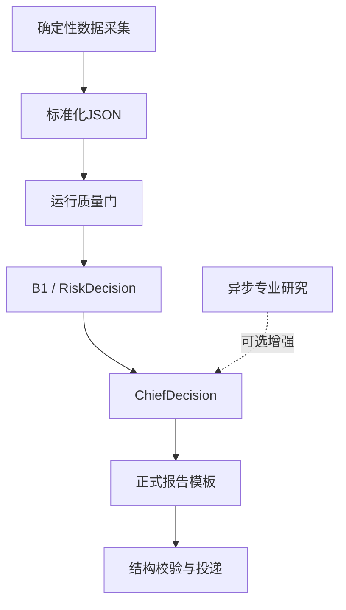

# strategy_team

持续进化的投资策略 Team。

## 核心目标

辅助完成：

- 市场择时
- 产业研究
- 主线/板块判断
- 选股池
- 买入计划
- 持仓研判
- 卖出风控
- 总控决策
- 交易复盘与策略进化

## 生产架构

正式报告关键路径不创建、不调用、不等待专业 Agent 或 Subagent。异步研究缺失只降低证据覆盖率，不阻断报告，也不得提高交易权限。

## 目录

- `00_governance`：总规则、工作流、角色边界、数据契约
- `01_data`：市场、板块、持仓、候选池等数据
- `02_agents`：异步研究角色说明、模板、数据结构；不属于定时报告关键路径
- `03_daily_plans`：面向用户的盘前日报和14:45报告；`_supporting`为忽略的运行中间产物
- `04_reviews`：正式日/周/月复盘；`*_review_draft.md`为忽略的临时草稿
- `05_strategy_versions`：策略版本记录
- `06_logs`：流水线运行日志
- `07_tools`：采集、分析、生成报告脚本

## 当前阶段

Phase 2：确定性生产主链，异步研究增强。

## 关键规则

1. 个股服从板块，板块服从大盘。
2. 风控优先于买入。
3. stock_pool 负责选股，buy_strategy 负责买入计划。
4. risk_control 拥有否决权。
5. chief_decision 是最终交易计划输出层。
6. 所有计划必须可复盘。
