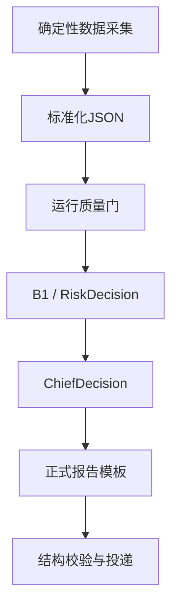

# strategy_team

确定性脚本驱动的 A 股交易策略系统。

## 项目定位

辅助完成市场择时、产业研究、主线/板块判断、选股池、买入计划、持仓研判、卖出风控、总控决策、交易复盘与策略进化。

**核心原则：数据采集与分析判断用确定性脚本，LLM 仅负责格式化和输出摘要。** 所有数据收集和指标计算由 Python 脚本完成，LLM 不参与策略判断。

## 快速开始

### 环境要求

- Python 3.11+（推荐通过 [uv](https://github.com/astral-sh/uv) 管理）
- 通达信客户端（本地日线数据源）
- mootdx（Python 库，数据访问层）

### 安装

```bash
git clone <repo-url> strategy_team
cd strategy_team

# 安装依赖
uv sync
# 或手动: uv pip install mootdx pandas requests

# 如果使用 OpenClaw 作为运行时
# 确保 openclaw.json 中 agents.defaults.workspace 指向本项目目录
```

### 配置

1. **通达信路径**：设置环境变量 `TDX_ROOT` 指向通达信安装目录（默认 `E:\new_tdx64`），脚本通过 `os.environ.get("TDX_ROOT", ...)` 读取

2. **研究数据根目录**：环境变量 `S_DATA_ROOT` 指向含 `Q_DATA/CSV_DATA` 的 qlib/CSV 数据根（默认 `E:\S_DATA`）；`s_data.py`、`backtest_factors.py --s-data-root`、`launch_point_study.py --s-data-root` 均以它为默认值，便于在非 Windows 环境跑回测/walk-forward

2. **持仓数据**：在 `01_data/trades/` 下维护：
   - `master_trade_ledger.csv` — 全量交易主台账
   - `current_positions.json` — 当前持仓快照
   - `_import_meta.json` — 导入元数据（imported_at / source_mtime / rows，供持仓新鲜度判定）
   - `position_confirmations.json` — 交易日无交易确认标记（`{日期: {no_trades: true, ...}}`）

3. **交易日历**：`00_governance/contracts/CN_TRADING_CALENDAR.json` 包含年度休市安排，可通过 `trading_calendar.py --check-date YYYYMMDD` 查询

4. **RSS 源**：`00_governance/contracts/RSS_SOURCE_REGISTRY.json` 定义新闻源，`RSS_FILTER_CONFIG.json` 定义过滤规则

## 目录结构

```
strategy_team/
├── 00_governance/          # 治理层，按**生命周期**分四类（2026-08-06 重构）
│   ├── strategy/                    # 规则：改动要进 05_strategy_versions
│   │   ├── b1_swing_strategy.md         # B1 波段策略主文件
│   │   ├── cz_strategy.md               # CZ 认知框架（18.1–18.22）
│   │   ├── DECISION_PRIORITY_RULES.md
│   │   ├── BUY_STRATEGY_INTEGRATION_RULES.md
│   │   └── ...                          # 持仓检查手册/执行纪律/均线框架等
│   ├── data/                        # 数据层现状与接口能力（随数据源变动）
│   │   ├── DATA_SOURCE_PRINCIPLE.md     # 三条原则 + 各源现状（含连接管理硬要求）
│   │   ├── DATA_SOURCE_COVERAGE_MATRIX.md  # 九大类数据需求 × 可用性标记
│   │   ├── TDX_LOCAL_INTERFACES.md      # 已接入用法 + 探过未接（附风险等级）
│   │   ├── MOOTDX_INTERFACES.md         # Reader/Quotes/Affair 三入口
│   │   └── QLIB_LOCAL_DATA.md           # S_DATA bundle（含退市股、已前复权）
│   ├── research/                    # 回测研究：只增，结论会被推翻
│   │   └── B1_BACKTEST_FINDINGS.md
│   └── contracts/                   # 契约 + 运行时配置：**代码直接依赖**
│       ├── MASTER_WORKFLOW.md / SCREENING_WORKFLOW.md / DATA_FLOW_CONTRACT.md
│       ├── CN_TRADING_CALENDAR.json     # 交易日历（7 处代码引用）
│       ├── SCREEN_FORMULA_REGISTRY.json # 选股公式注册表
│       └── RSS_SOURCE_REGISTRY.json / RSS_FILTER_CONFIG.json
│   # ⚠️ 所有配置路径只在 07_tools/paths.py 定义一次，不要自己拼 BASE/"00_governance"/...
├── 01_data/                # 运行时数据（gitignore）
│   ├── holdings/                    # 持仓技术分析
│   ├── market/                      # 行情、市场择时输入
│   ├── news/                        # RSS 新闻
│   ├── quality/                     # 运行门控
│   ├── screening/                   # 选股链中间产物（公式命中、充实候选）
│   ├── stock_pool/                  # 选股链分层输出（StockPool 契约）
│   ├── trades/                      # 交易台账、持仓快照
│   └── ...
├── 02_agents/              # [已废弃] 纯脚本驱动不再需要多角色 Agent 规格（编号不复用，目录已删）
├── 03_daily_plans/         # 盘前日报、14:45 报告（gitignore，运行时生成）
├── 04_reviews/             # 盘后复盘
├── 05_strategy_versions/   # 策略版本记录
├── 06_logs/                # 运行日志（gitignore，运行时创建）
├── 07_tools/               # 全部脚本
│   ├── run_0850.py                  # 08:50 盘前预采集
│   ├── run_0905.py                  # 09:05 盘前日报
│   ├── run_1445.py                  # 14:45 尾盘操作建议
│   ├── run_1700.py                  # 17:00 盘后复盘
│   ├── run_1800.py                  # 18:00 每日选股（独立链）
│   ├── daily_pipeline.py            # 通用管线
│   ├── generate_risk_and_sectors.py # risk_decision + sector_state 生成
│   ├── collect_holding_quotes.py    # 持仓行情采集（mootdx）
│   ├── collect_incremental_market.py # 增量市场数据
│   ├── collect_fund_flow.py         # 资金流向（东方财富）
│   ├── calc_mfe_mae.py              # MFE/MAE 计算
│   ├── trading_calendar.py          # 交易日历查询
│   ├── runtime_gate.py              # 运行门控
│   ├── close_review/                # 尾盘+盘后复盘
│   ├── market_timing/               # 市场择时、B1 状态
│   ├── news/                        # RSS 采集与过滤
│   ├── screening/                   # 每日选股链（公式初筛→充实→打分→表格）
│   ├── trades/                      # 交易台账维护
│   └── local_tdx/                   # mootdx 封装
└── tests/                  # 独立测试目录（pytest，59 个测试文件，670 passed）
    ├── conftest.py                  # sys.path + 导入设置
    ├── test_base_path_depth.py      # BASE 路径深度防回归
    ├── test_run_0850.py / test_run_0905.py / test_run_1445.py / test_run_1700.py  # 四个时点 runner
    ├── test_runners_smoke.py        # runner 冒烟
    ├── test_runtime_guards.py       # 运行门控（含 as_of 陈旧判定）
    ├── test_feishu_report_publisher.py  # 报告投递（摘要提取 / HTTP / 门控阻断 / 半成功）
    ├── test_close_review.py / test_final_review_validator.py / test_review_enrichment.py
    ├── test_b1_holding_state.py / test_amv_state.py / test_technical_monitor.py
    ├── test_backtest_factors.py / test_launch_point_study.py / test_s_data.py  # 研究链
    ├── test_score_candidates.py / test_enrich_b1cz.py / test_candidate_table.py  # 选股链
    └── ...                          # 其余见 `ls tests/`；全量执行 `uv run pytest -q`
```

### 运行测试

```bash
uv run pytest -q                    # 全量
uv run pytest tests/test_run_1445.py -q   # 单文件
```

## 日常运行

交易日四个时点自动触发（通过 OpenClaw cron 或手动执行）：

| 时间 | 脚本 | 说明 |
|---|---|---|
| 08:50 | `run_0850.py` | 交易日历检查 → 公告/海外行情/RSS 采集 → 增量市场数据 |
| 09:05 | `run_0905.py` | 交易日历检查 → daily_pipeline(premarket) → 日报摘要 |
| 14:45 | `run_1445.py` | 交易日历检查 → 持仓行情采集 → 运行门控 → close_review → 尾盘建议 |
| 17:00 | `run_1700.py` | 交易日历检查 → 持仓收盘行情 → 增量市场数据 → MFE/MAE → 资金流向 → daily_pipeline(postclose) → final_close_review → 验证 |
| 18:00 | `run_1800.py` | 每日选股独立链（与三份报告分离）：**门控落盘(只建议不阻断)** → **股票名称表刷新(ST 硬排除依据)** → 概念标签刷新 → **板块指数刷新(sector_phase hint 用)** → 公式初筛 → 模式识别 → 共振打分 → 备选表格（含 **🧭 当日主线指纹**：候选池板块族密度榜，情境感知非进场gate）；消费 17:00 链产出的当日 sector_state/risk_decision |

### 手动执行

```bash
# 查询是否交易日
uv run python 07_tools/trading_calendar.py --check-date 20260717

# 盘前日报
uv run python 07_tools/run_0905.py

# 14:45 尾盘建议
uv run python 07_tools/run_1445.py

# 17:00 盘后复盘
uv run python 07_tools/run_1700.py

# 18:00 每日选股
uv run python 07_tools/run_1800.py
```

## 数据源

| 数据 | 来源 | 工具 |
|---|---|---|
| A 股日线 | mootdx Reader（本地 .day 文件） | `local_tdx_data.py` |
| 实时行情 | mootdx Quotes（在线 bars） | `collect_holding_quotes.py` |
| 指数行情 | mootdx Reader / online index | `collect_holding_quotes.py` |
| 市场宽度（880系列） | mootdx Reader | `collect_incremental_market.py` |
| 财务数据 | mootdx Affair | `local_tdx_data.py` |
| **PIT 财务（带公告日）** | 东方财富 datacenter（业绩报表 RPT_LICO_FN_CPD） | `local_tdx/fetch_pit_financials.py` |
| **真市值 / 总股本** | 东方财富 datacenter（估值分析 RPT_VALUEANALYSIS_DET，2018-01-02 起） | `local_tdx/fetch_market_cap.py` |
| **前复权（全链默认口径）** | 通达信协议 xdxr 权息数据（分红/送转/配股/缩股）→ 本地缓存 → 自算因子 | `local_tdx/adjust_factors.py` |
| 复权因子（旧路径，仅 CLI） | mootdx get_adjust_year | `local_tdx_data.py --mode adjust` |
| A50/汇率 | Yahoo Finance | `collect_incremental_market.py` |
| 资金流向 | 东方财富 push2 API | `collect_fund_flow.py` |
| 北交所行情 | 东方财富 push2 API（mootdx 不支持 BJ） | `collect_holding_quotes.py` |
| 公告 | wenda_notice_query | cron LLM 调用 |
| 概念/主题标签 | TQ download_file down_type=4（miscinfo） | `local_tdx/concept_tags.py` |
| **股票名称（ST 判定唯一依据）** | 东财 push2 ulist（多域名轮询，按需批量查候选）→ TQ-Local get_stock_info → 本地缓存 | `local_tdx/stock_names.py` |
| 新闻 | RSS | `rss_collector.py` |
| TQ 选股公式批量筛选 | TQ-Local（formula_process_mul_xg，需 TdxW 运行） | `screening/formula_screen.py` |

## 策略核心

### B1 波段策略

详见 `00_governance/strategy/b1_swing_strategy.md`。关键机制：

- **BBI**：`(MA3 + MA6 + MA12 + MA24) / 4`，预警而非最终权威
- **N 结构**：上升 N（L1→H1→更高 L2）/ 下降 N（H1→L1→更低 H2→收盘低于 L1）
- **反转 K**：`J<13` + 量比 `≤50%` + 20 日成交量底部 10% + 收盘变动 `-2%~+2%` + 振幅 `≤7%`
- **P0/P1/P2/P3 优先级**：P0 > P1 > P2 > P3
- **持仓状态**：`b1_holding_state.py` 输出 `B1-holding-v1` 契约

### 决策优先级

1. 个股服从板块，板块服从大盘
2. 风控优先于买入
3. 候选池由每日选股 screening 链产出（18:00 独立运行，与三份报告分离：`screening/formula_screen.py` 公式初筛 → `enrich_candidates.py` 模式识别 → `score_candidates.py` 板块共振打分分层 A/B/C/D → `candidate_table.py` 备选表格，输出 `01_data/stock_pool/`，详见 `00_governance/contracts/SCREENING_WORKFLOW.md`）；StockPool 仅为证据层候选，买入计划由 chief_decision 统一裁决
4. risk_control 拥有否决权
5. chief_decision 是最终交易计划输出层
6. 所有计划必须可复盘

### 运行门控

`runtime_gate.py` 在每次报告生成前检查：
- 交易日历
- 持仓新鲜度
- 技术数据新鲜度
- 市场质量（0AMV、宽度、成交额；**按 `as_of` 判定新鲜度**，当日文件里装 T-1 数据同样记 `stale`）
  - **评分按关键性加权**（2026-07-31）：`0AMV 35 / 宽度 20 / 成交额 20 / 情绪 15 / 海外 10`。此前是无权重算术平均（5 项各 0.2），导致「0AMV 全缺 + 其余齐全」= 4/5 = **0.8 恰好判 pass 并授予加仓权**。0AMV 决定 regime，缺它等于不知道方向，故 **0AMV 非 confirmed/auto 时一律不得 pass**（只降为 `degraded`，不新增阻断）。
  - **`blocked` 改为显式覆盖率规则**：四个核心块（0AMV/宽度/情绪/成交额）**全部** stale/missing 才算「大面积缺数」。原先是 `score < 0.4` 这个魔数阈值——加权后它会凭空多出 24 种阻断场景（256 组合实测），而 blocked 经 `--require-quality`/`--require-gate` 真正中断链路，重演 07-30 事故。现规则下：新增 blocked = 0，6 个原 pass 收紧为 degraded，0 个放松为 pass。
  - **`limitations` 字段**：degraded 时列出具体受限项（哪个块 stale、as_of 是哪天），报告可据此归因，不再只有一个分数。
- 持仓行情是否当日
- **加仓授权（`position_gate.allow_position_increase`）**：需 ①持仓基线 confirmed + 全持仓当日行情 ②当日技术指标 ③`market_quality=pass` ④0AMV 新鲜 ⑤regime 属白名单 `{做多, 中性}`。此前写作 `regime != "空头"`，0AMV 缺失时 `effective_state` 是 None → 空串 → `"" != "空头"` 为真 ⇒ **regime 未知却授予加仓权**（2026-07-31 修）。regime 文本经 `normalize_regime` 归一，覆盖三套并行词表：`effective_state`（做多/中性/空头）、`amv_zone`（做多触发/空头触发/阈值内，merge 会用它兜底填 effective_state）、README 曾用的「多头」。判定逻辑抽成纯函数 `position_increase_decision`，可单测。

门控必须能**真正阻断**，而非只写 JSON。退出码：

| 退出码 | 触发条件 | 启用开关 |
|---|---|---|
| 0 | 通过 | — |
| 3 | 非交易日 | `--require-trading-day` |
| 4 | `market_quality=blocked` | `--require-quality` |
| 5 | `position_gate=blocked` | `--require-position-gate` |

- **17:00 盘后链**：门控结论一律落盘并记进 stage note（含 stale 明细），但**默认不阻断**。需要硬失败时给 `daily_pipeline --strict-quality-gate`（仅对 postclose 生效，blocked → exit 4）。⚠️ 2026-07-30 曾让 postclose 默认带 `--require-quality`，同时又收紧了 `as_of` 陈旧判定，两者叠加导致 17:00 盘后复盘直接失败——硬闸须等新的 stale 校准跑过若干交易日、确认 blocked 只在真正大面积缺数时出现，再显式开启。
- **session 期望数据日**：陈旧判定按 session 比对——preclose(08:50/09:05/14:45)期望 T-1（当日 K 线尚不存在，as_of=T-1 不算陈旧），postclose(17:00/1800)期望当日。`daily_pipeline` 已按 `--session-type` 自动传 `--data-session`；评分器(market_timing_scorer)按 section `as_of` 与评分日比对，T-1 数据一律按中性处理不给满分。
- **退出码可消费**：门控退出码会穿透 `daily_pipeline` 进程本身（非交易日 3 / 质量 blocked 4 / 持仓 blocked 5）,cron 可直接按码判定。
- **18:00 选股链只落盘、不阻断**：18:00 是纯粹的选股流程，门控**不得影响选股结果**（不改 bucket / next_step / 分层、不筛候选），只由 `candidate_table` 在备选表里给出独立的「🚦 数据可信度提示」区块。这样选股结果与回测同口径且可复现——门控若改写分层，live 候选就无法与回测对照，「策略本身选出了什么」将不可回溯。
- **09:05 / 14:45 不启用**：0AMV 与市场宽度本就要等收盘，盘中 blocked 属正常；14:45 把门控结论写进 `06_logs/{date}_1445_run_log.json`（`_gate_note`）留痕并降低报告内的权限文案。
- **投递侧**：`feishu_report_publisher.py --require-gate` 在投递前复核门控，非交易日或 `market_quality=blocked` 时拒发并 `exit 4`。
- **08:50 采集**：任一 stage 失败 → run log 写 `status="degraded"` 并列出失败项；09:05 按 **discovery stage 逐项 ok** 决定是否复用（`overseas`/`rss_collect`/`rss_filter` 任一失败即重采），不再只看 `status=="completed"`。

## OpenClaw Cron 配置

如果使用 OpenClaw 作为运行时，cron job 配置如下（以 `state/openclaw.sqlite` 的 `cron_jobs` 表为准）：

> 报告投递：三个报告 job（0905/1445/1700）统一由 `07_tools/feishu_report_publisher.py` 完成——聊天发执行摘要（≤800 字）+ 完整报告 md 文件附件，不再经 LLM message 工具。凭据从环境变量或 `OPENCLAW_CONFIG` 读取。建议加 `--require-gate`（门控 blocked 时拒发，exit 4）；失败时 stdout 会打印 `{"sent": false, "partial": ..., "progress": {...}}`，可据此识别"附件已发、摘要未发"的半成功。
>
> ⚠️ **收件人必须显式配置**（2026-08-03 起）：`FEISHU_TO_OPEN_ID` 环境变量，或 `openclaw.json` 的 `channels.feishu.accounts.default.reportToOpenId`（亦接受 `toOpenId` / `defaultToOpenId`）。此前缺配置会兜底到一个**硬编码 open_id**——换人/换租户/别人机器上跑都会把报告静默发给那个写死的账号。现在缺配置直接 `FeishuError` + exit 1，请在部署环境里补上这项配置。

| job ID 前缀 | 时间 | 任务 | toolsAllow |
|---|---|---|---|
| `580631b2` | 08:50 | `run_0850.py` + wenda 公告检索 + 写 premarket_intelligence（含 RSS 候选风控研判） | exec, read, write, wenda_notice_query |
| `26a0f75e` | 09:05 | `run_0905.py` | exec, read |
| `708356c6` | 14:45 | `run_1445.py` | exec |
| `e4a91dc9` | 15:15 | 盘后补数提醒（0AMV/交易确认） | exec |
| `6280f5fc` | 17:00 | `run_1700.py` | exec, read |
| `60e0b744` | 18:00 | `run_1800.py` 每日选股独立链 | exec, read |
| `f15c0d06` | 周六 10:07 | `weekly_review.py` 周度复盘 + LLM 归因总结 | exec, read |
| `73a4ff49` | 周五 14:35 | `trading_calendar.py --require-refresh` 刷新交易日历 | exec |
| `77bf788f` | 15:00 | 14:45 报告投递验收（主会话 systemEvent） | — |

## 注意事项

- **BJ 股票（920xxx）**：mootdx Reader/Quotes 不支持北交所，通过东方财富 push2 API fallback
- **mootdx Reader**：`daily()` 返回 DatetimeIndex 而非列，传入分析脚本前需 `reset_index()`
- **0AMV**：`run_1700` 先跑 `sync_compass_amv.py` 从指南针自动写 confirmed 观测并回填 `amv_0day`，`merge_incremental_market` 据此自动置 `quality: confirmed`，随后 `amv_state` 据真值切换 regime（单日 >+4% 进多头 / <-2.3% 进空头）。指南针不可用时回退人工确认（15:15 后告知数值，由 LLM 写入 `0amv_observations.jsonl` 的 confirmed 观测）
- **无交易默认**：B1 策略默认盘中不交易，除非用户确认或成交台账更新
- **数据不入库**：`01_data/` 下的运行时数据通过 .gitignore 排除，只保留 `.md` 模板

## 生产架构


```mermaid
flowchart TD
    A[确定性数据采集] --> B[标准化JSON]
    B --> C[运行质量门]
    C --> D[B1 / RiskDecision]
    D --> E[ChiefDecision]
    E --> F[正式报告模板]
    F --> G[结构校验与投递]
```

正式报告使用确定性脚本主链，不创建、不调用、不等待专业 Agent 或 Subagent。
