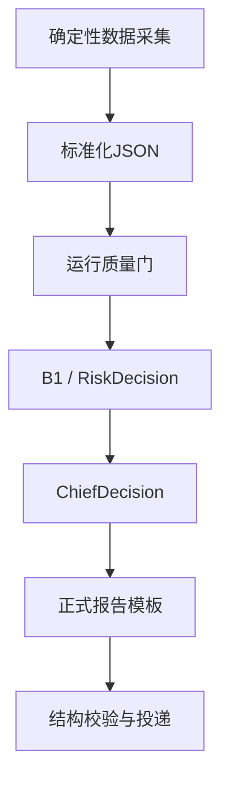

# strategy_team

确定性脚本驱动的 A 股交易策略系统。

## 项目定位

辅助完成市场择时、产业研究、主线/板块判断、选股池、买入计划、持仓研判、卖出风控、总控决策、交易复盘与策略进化。

**核心原则：数据采集与分析判断用确定性脚本，LLM 仅负责格式化和输出摘要。** 所有数据收集和指标计算由 Python 脚本完成，LLM 不参与策略判断。

## 快速开始

### 环境要求

- Python 3.11+（推荐通过 [uv](https://github.com/astral-sh/uv) 管理）
- 通达信客户端（本地日线数据源）
- mootdx（Python 库，数据访问层）

### 安装

```bash
git clone <repo-url> strategy_team
cd strategy_team

# 安装依赖
uv sync
# 或手动: uv pip install mootdx pandas requests

# 如果使用 OpenClaw 作为运行时
# 确保 openclaw.json 中 agents.defaults.workspace 指向本项目目录
```

### 配置

1. **通达信路径**：设置环境变量 `TDX_ROOT` 指向通达信安装目录（默认 `E:\new_tdx64`），脚本通过 `os.environ.get("TDX_ROOT", ...)` 读取

2. **研究数据根目录**：环境变量 `S_DATA_ROOT` 指向含 `Q_DATA/CSV_DATA` 的 qlib/CSV 数据根（默认 `E:\S_DATA`）；`s_data.py`、`backtest_factors.py --s-data-root`、`launch_point_study.py --s-data-root` 均以它为默认值，便于在非 Windows 环境跑回测/walk-forward

2. **持仓数据**：在 `01_data/trades/` 下维护：
   - `master_trade_ledger.csv` — 全量交易主台账
   - `current_positions.json` — 当前持仓快照
   - `_import_meta.json` — 导入元数据（imported_at / source_mtime / rows，供持仓新鲜度判定）
   - `position_confirmations.json` — 交易日无交易确认标记（`{日期: {no_trades: true, ...}}`）

3. **交易日历**：`00_governance/contracts/CN_TRADING_CALENDAR.json` 包含年度休市安排，可通过 `trading_calendar.py --check-date YYYYMMDD` 查询

4. **RSS 源**：`00_governance/contracts/RSS_SOURCE_REGISTRY.json` 定义新闻源，`RSS_FILTER_CONFIG.json` 定义过滤规则

## 目录结构

```
├── 00_governance/     治理层，按**生命周期**分四类（各目录有自己的 README 索引）
│   ├── strategy/          规则：一个策略 = 一个上下文目录（b1/ cz/ _factors/ _shared/）
│   ├── data/              数据源现状与接口能力（随数据源变动）
│   ├── research/          回测研究：17 个单元，只增，结论会被推翻
│   └── contracts/         契约 + 运行时配置：**代码直接依赖**
├── 01_data/           运行时数据（gitignore，只保留 .md 模板）
├── 03_daily_plans/    盘前日报、14:45 报告（gitignore）
├── 04_reviews/        盘后复盘
├── 05_strategy_versions/  版本记录 + TODO.md（待办集中在这里）
├── 06_logs/           运行日志（gitignore）
├── 07_tools/          全部脚本（分层见下）
└── tests/             pytest（3400+ 用例，`uv run pytest -q`）
```

`07_tools/` 按**依赖分层**组织，下层不得依赖上层（`tests/test_architecture_layers.py` 强制）：

| 层 | 目录 | 职责 |
|---|---|---|
| L0 基础 | 根目录 `paths` `code_utils` `indicators` `fmt` `contracts` `pipeline_kit` `runtime_guards` `net_retry` | 路径/代码/指标/格式化/**产物契约**/管线工具 |
| L1 数据 | `local_tdx/` `collect/` `news/` `s_data.py` | 通达信、行情采集、RSS、qlib bundle |
| L2 因子 | `factors/`(21 因子，每个一份) `trades/` | 因子实现层 + 交易台账 |
| L3 决策 | `screening/` `market_timing/` `holdings/` `close_review/` | 选股链、择时、持仓状态、复盘 |
| L4 编排 | 根目录 `run_*.py` `daily_pipeline.py`、`research/` | 五个时点 runner；研究/回测（在生产链**之上**） |

三条硬约束：

- **路径只在 `07_tools/paths.py` 定义一次** —— 不要自己拼 `BASE / "00_governance" / ...`（有测试强制）
- **因子实现全项目唯一一份**，其他模块通过调用访问（`factors/` + 注册表，测试对着 import 图核对）
- **产物 schema 在 `07_tools/contracts.py`**（24 个产物），生产者落盘前 `require(...)`；
  治理层的 `.md` 不参与执行、会漂移，字段级真相以代码为准

研究/回测**统一入口**（14 个工具，含状态与模式清单）：

```bash
uv run python 07_tools/research/__main__.py
```

### 运行测试

```bash
uv run pytest -q                    # 全量
uv run pytest tests/test_run_1445.py -q   # 单文件
```

## 日常运行

交易日四个时点自动触发（通过 OpenClaw cron 或手动执行）：

| 时间 | 脚本 | 说明 |
|---|---|---|
| 08:50 | `run_0850.py` | 交易日历检查 → 公告/海外行情/RSS 采集 → 增量市场数据 |
| 09:05 | `run_0905.py` | 交易日历检查 → daily_pipeline(premarket) → 日报摘要 |
| 14:45 | `run_1445.py` | 交易日历检查 → 持仓行情采集 → 运行门控 → close_review → 尾盘建议 |
| 17:00 | `run_1700.py` | 交易日历检查 → 持仓收盘行情 → 增量市场数据 → MFE/MAE → 资金流向 → daily_pipeline(postclose) → final_close_review → 验证 |
| 18:00 | `run_1800.py` | 每日选股独立链（与三份报告分离）：**门控落盘(只建议不阻断)** → **股票名称表刷新(ST 硬排除依据)** → 概念标签刷新 → **板块指数刷新(sector_phase hint 用)** → 公式初筛 → 模式识别 → 共振打分 → 备选表格（含 **🧭 当日主线指纹**：候选池板块族密度榜，情境感知非进场gate）；消费 17:00 链产出的当日 sector_state/risk_decision |

### 手动执行

```bash
# 查询是否交易日
uv run python 07_tools/trading_calendar.py --check-date 20260717

# 盘前日报
uv run python 07_tools/run_0905.py

# 14:45 尾盘建议
uv run python 07_tools/run_1445.py

# 17:00 盘后复盘
uv run python 07_tools/run_1700.py

# 18:00 每日选股
uv run python 07_tools/run_1800.py
```

## 数据源

| 数据 | 来源 | 工具 |
|---|---|---|
| A 股日线 | mootdx Reader（本地 .day 文件） | `local_tdx_data.py` |
| 实时行情 | mootdx Quotes（在线 bars） | `collect_holding_quotes.py` |
| 指数行情 | mootdx Reader / online index | `collect_holding_quotes.py` |
| 市场宽度（880系列） | mootdx Reader | `collect_incremental_market.py` |
| 财务数据 | mootdx Affair | `local_tdx_data.py` |
| **PIT 财务（带公告日）** | 东方财富 datacenter（业绩报表 RPT_LICO_FN_CPD） | `local_tdx/fetch_pit_financials.py` |
| **真市值 / 总股本** | 东方财富 datacenter（估值分析 RPT_VALUEANALYSIS_DET，2018-01-02 起） | `local_tdx/fetch_market_cap.py` |
| **前复权（全链默认口径）** | 通达信协议 xdxr 权息数据（分红/送转/配股/缩股）→ 本地缓存 → 自算因子 | `local_tdx/adjust_factors.py` |
| 复权因子（旧路径，仅 CLI） | mootdx get_adjust_year | `local_tdx_data.py --mode adjust` |
| A50/汇率 | Yahoo Finance | `collect_incremental_market.py` |
| 资金流向 | 东方财富 push2 API | `collect_fund_flow.py` |
| 北交所行情 | 东方财富 push2 API（mootdx 不支持 BJ） | `collect_holding_quotes.py` |
| 公告 | wenda_notice_query | cron LLM 调用 |
| 概念/主题标签 | TQ download_file down_type=4（miscinfo） | `local_tdx/concept_tags.py` |
| **股票名称（ST 判定唯一依据）** | 东财 push2 ulist（多域名轮询，按需批量查候选）→ TQ-Local get_stock_info → 本地缓存 | `local_tdx/stock_names.py` |
| 新闻 | RSS | `rss_collector.py` |
| TQ 选股公式批量筛选 | TQ-Local（formula_process_mul_xg，需 TdxW 运行） | `screening/formula_screen.py` |

## 策略核心

### B1 波段策略

详见 `00_governance/strategy/b1/01_swing_rules.md`。关键机制：

- **BBI**：`(MA3 + MA6 + MA12 + MA24) / 4`，预警而非最终权威
- **N 结构**：上升 N（L1→H1→更高 L2）/ 下降 N（H1→L1→更低 H2→收盘低于 L1）
- **反转 K**：`J<13` + 量比 `≤50%` + 20 日成交量底部 10% + 收盘变动 `-2%~+2%` + 振幅 `≤7%`
- **P0/P1/P2/P3 优先级**：P0 > P1 > P2 > P3
- **持仓状态**：`b1_holding_state.py` 输出 `B1-holding-v1` 契约

### 决策优先级

1. 个股服从板块，板块服从大盘
2. **风控优先于买入**；`risk_control` 拥有否决权
3. 候选池由 18:00 选股链产出（与三份报告分离），**仅为证据层候选** —— 买入计划由 `chief_decision` 统一裁决
4. `chief_decision` 是最终交易计划输出层
5. 所有计划必须可复盘

⚠️ **同一事实的多个读数按「证据新鲜度」取**（2026-08-07 定案）：14:45 盘中以**实时价重算的 B1** 为准，
压过同日期标签但依据为 T-1 收盘的 RiskDecision；17:00 盘后两边依据相同，回到「风控优先」。
完整规则见 [`00_governance/strategy/_shared/decision_priority.md`](00_governance/strategy/_shared/decision_priority.md)。

### 运行门控

`runtime_gate.py` 在每次报告生成前检查交易日历、持仓新鲜度、技术数据新鲜度、
市场质量（**按 `as_of` 判新鲜度** —— 当日文件里装 T-1 数据同样记 `stale`）、加仓授权。

门控必须能**真正阻断**，而非只写 JSON。退出码会穿透 `daily_pipeline`，cron 可直接按码判定：

| 退出码 | 触发条件 | 启用开关 |
|---|---|---|
| 0 | 通过 | — |
| 3 | 非交易日 | `--require-trading-day` |
| 4 | `market_quality=blocked` | `--require-quality` |
| 5 | `position_gate=blocked` | `--require-position-gate` |

各时点策略：**09:05 / 14:45 不启用**（0AMV 与宽度本就要等收盘）；
**17:00 落盘但默认不阻断**（硬闸需 `--strict-quality-gate` 显式开）；
**18:00 选股链只提示、不得影响选股结果**（否则 live 候选无法与回测对照）。

⚠️ 评分权重、`blocked` 覆盖率规则、加仓授权的五个条件，以及 2026-07-30
「硬闸叠加导致 17:00 链失败」的事故记录 ——
见 [`00_governance/contracts/RUNTIME_GATE.md`](00_governance/contracts/RUNTIME_GATE.md)。**改任何判定前先读它。**

## OpenClaw Cron 配置

如果使用 OpenClaw 作为运行时，cron job 配置如下（以 `state/openclaw.sqlite` 的 `cron_jobs` 表为准）：

> **报告投递**：三个报告 job（0905/1445/1700）统一由 `07_tools/feishu_report_publisher.py` 完成
> —— 聊天发执行摘要（≤800 字）+ 完整报告 md 附件。建议加 `--require-gate`（门控 blocked 时拒发，exit 4）。
>
> ⚠️ **收件人必须显式配置**（`FEISHU_TO_OPEN_ID` 或 `openclaw.json` 的 `reportToOpenId`）——
> 缺配置直接报错而不是兜底。凭据/收件人的完整优先级、以及为什么不再兜底到硬编码 open_id，
> 见该脚本的模块与 `_recipient()` 的 docstring（就在会改它的人眼前，不在这里重复）。

| job ID 前缀 | 时间 | 任务 | toolsAllow |
|---|---|---|---|
| `580631b2` | 08:50 | `run_0850.py` + wenda 公告检索 + 写 premarket_intelligence（含 RSS 候选风控研判） | exec, read, write, wenda_notice_query |
| `26a0f75e` | 09:05 | `run_0905.py` | exec, read |
| `708356c6` | 14:45 | `run_1445.py` | exec |
| `e4a91dc9` | 15:15 | 盘后补数提醒（0AMV/交易确认） | exec |
| `6280f5fc` | 17:00 | `run_1700.py` | exec, read |
| `60e0b744` | 18:00 | `run_1800.py` 每日选股独立链 | exec, read |
| `f15c0d06` | 周六 10:07 | `weekly_review.py` 周度复盘 + LLM 归因总结 | exec, read |
| `73a4ff49` | 周五 14:35 | `trading_calendar.py --require-refresh` 刷新交易日历 | exec |
| `77bf788f` | 15:00 | 14:45 报告投递验收（主会话 systemEvent） | — |

## 注意事项

- **BJ 股票（920xxx）**：mootdx Reader/Quotes 不支持北交所，通过东方财富 push2 API fallback
- **mootdx Reader**：`daily()` 返回 DatetimeIndex 而非列，传入分析脚本前需 `reset_index()`
- **0AMV**：`run_1700` 先跑 `sync_compass_amv.py` 从指南针自动写 confirmed 观测并回填 `amv_0day`，`merge_incremental_market` 据此自动置 `quality: confirmed`，随后 `amv_state` 据真值切换 regime（单日 >+4% 进多头 / <-2.3% 进空头）。指南针不可用时回退人工确认（15:15 后告知数值，由 LLM 写入 `0amv_observations.jsonl` 的 confirmed 观测）
- **无交易默认**：B1 策略默认盘中不交易，除非用户确认或成交台账更新
- **数据不入库**：`01_data/` 下的运行时数据通过 .gitignore 排除，只保留 `.md` 模板

## 生产架构


```mermaid
flowchart TD
    A[确定性数据采集] --> B[标准化JSON]
    B --> C[运行质量门]
    C --> D[B1 / RiskDecision]
    D --> E[ChiefDecision]
    E --> F[正式报告模板]
    F --> G[结构校验与投递]
```

正式报告使用确定性脚本主链，不创建、不调用、不等待专业 Agent 或 Subagent。
