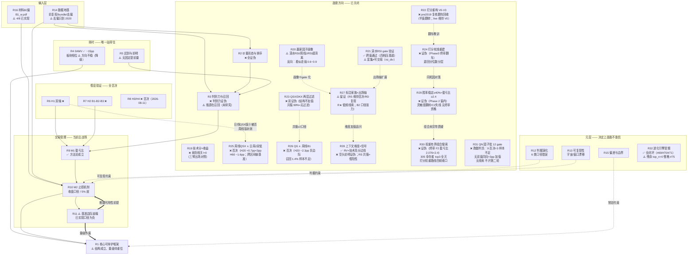

# B1 研究单元索引与主图

> 目的：沉淀 B1（J<13 反转买点）系统性回测的**结论、框架形态、偏差警示、工具用法**，
> 防止后续重复踩坑或误把有偏结果当实盘预期。
> **所有内容为研究结论，未改动任何线上买入逻辑。**
>
> 2026-08-06 由单文件 `B1_BACKTEST_FINDINGS.md`（2456 行、按时间追加）拆成 17 个研究单元。
> 拆分理由：同一主题的结论散落在十几处，而**后面的常常推翻前面的** ——
> 按时间读会先读到已被作废的数字。原文见 git 历史。

## 主图：研究单元之间的关系

**读图要点**：粗箭头（`==>`）是**推翻关系**。R11 是目前最新、也最具破坏性的一环——
它不否定 R10 的相对判定，但把「相对改善之上有可用策略」这个前提抽掉了。

## 证据等级

| 等级 | 含义 |
|---|---|
| **L4** | 跨年 walk-forward + **含退市宇宙** + 净值对照；或口径错误这类可证明的事实 |
| **L3** | 跨 seed / 跨区间方向一致，但宇宙**带幸存者偏差** |
| **L2** | 单一区间或样本内多重比较，**未 OOS** |
| **L1** | 合成数据 / 单案例 / 仅逻辑推演 / 材料转述 |
| **L0** | 已实现但**未跑** |

⚠️ **L3 及以下的结论不得进入 live 逻辑。** 教训来自 R2：`reversal_quality_inv`
样本内大胜 +69.4%，含退市跨年验证翻转为 −11.9%。

## 总账

| 单元 | 主题 | 结论 | 等级 | 状态 |
|---|---|---|---|---|
| [R1](R1_core_framework.md) | 核心可辩护框架 | 0AMV + 反转K + 带空间止损 + BBI + 分散 | L3 | ⚠️ 结构成立、**量级待重估** |
| [R2](R2_selection_price_volume.md) | 价量形态与排序 | 随机/等权 ≥ 一切价量选择器 | L4 | ❌ 证伪（章节关闭）|
| [R3](R3_selection_discriminability_recall.md) | 判别力与召回 | 无跨窗共同点；**瓶颈在召回**（⚠️ 2026-08-13 受影响窗重算：「≥100% 带 −37.5%」作废、「单调下降」软化，瓶颈方向不变）| L4 | ❌ / ⚠️ 未研究 |
| [R4](R4_timing_amv_sector.md) | 0AMV + 板块相位 | 0AMV ~15pp（三熊窗重取）；板块方向不稳（降级）| L4 / 降级 | ✅ 0AMV 成立（2026-08-09 重取）|
| [R5](R5_timing_lateness_sentinel.md) | 迟到与前哨 | 无可机械化的提前量（0→53 天）| L3 | ⚠️ 可利用性未证 |
| [R6](R6_hypothesis_H1_dual_axis.md) | 假设 H1 双轴 | 未过跨窗终审 | L3 | ❌ 否决 |
| [R7](R7_hypothesis_H2_b1b2b3.md) | 假设 H2 B1-B2-B3 | 全否决（regime 过拟合）| L3 | ❌ 否决 |
| [R8](R8_hypothesis_H3_H4_pending.md) | 假设 H3/H4 | H3 ❌ gate 级三重门槛；H4 ❌ 公式自相矛盾（互斥零触发） | L0 | ❌ 否决（2026-08-11） |
| [R9](R9_method_M1_payoff_ratio.md) | M1 盈亏比 | 胜率不是该优化的变量 | L3/L2 | ✅ 方法论 / ⚠️ 落地待重验 |
| [R10](R10_mechanism_M2_stops.md) | M2 止损机制 | 收盘口径最大改进；5% 是崖 | L2 | 🔄 **前提被 R11 推翻** |
| [R11](R11_baseline_margin_collapse.md) | ⚠️ 基准崩塌 | **已实现口径 3000 样本为负** | L3 | ⚠️ 成立 |
| [R12](R12_meta_criteria_evolution.md) | 判据演化 | 6 类口径错误已修 | L4 | ✅ 已修 |
| [R13](R13_meta_reproducibility.md) | 可复现性 | 宇宙与窗口在漂移 | L4 | ⚠️ 开关默认关 |
| [R14](R14_meta_data_foundation.md) | 数据地基 | 前复权已对账；**去偏只到 2020** | L4 | ⚠️ 有硬限制 |
| [R15](R15_meta_bias_and_limits.md) | 偏差与边界 | 六类偏差 + PIT/市值特性 | L4 | ✅ 常驻 |
| [R16](R16_input_material_corrections.md) | 材料纠偏 | 8 条，4 已实现 | L1 | ⚠️ 待排优先级 |
| [R17](R17_infra_tooling.md) | 工程与规范 | 瓶颈是评估不是加载 | L4 | ✅ |
| [R18](R18_b1_fingerprint_evidence.md) | 优秀 B1 指纹（正例样本） | 合成标签召回 2/10；单项腿召回尚可；命中集中样本末端 | L1 | ✅（正例口径，边界明示） |
| [R19](R19_score_vs_return.md) | live 技术分×收益 | 不正相关（弱负，三臂出场对照一致）；强档低胜率高盈亏比 | L3 | ❌ 证伪（2026-08-21）|
| [R20](R20_winner_factor_enrichment.md) | 赢家单因子画像 | 大赢家=超卖更深（深水RSI 4.8~6.2 四臂全稳）；输家=看似走强（0.6~0.9 稳定反向）；12% 止损保留差异、5% 压没 | L3 | ⚠️ 画像成立，选股仍关闭（2026-08-23）|
| [R21](R21_rsi_deep_gate_validation.md) | 深水RSI 进场 gate 验证 | ✅ 跨窗通过：四档出场压基底（margin +26~+42pp，Wilson 不重叠）；12% 止损跨窗跳升最优；rsi_div 富集≠可交易 | L3 | ✅ 跨窗通过，live 接线待 owner 拍板（2026-08-24）|
| [R22](R22_score_rebuild_variants.md) | 打分重构 V0-V3 | V2 证据重构翻正双窗（Spearman +0.09→+0.14）；篮子胜率 27%→47%/54%；V1 取反证伪；**pre2019 独立窗复核翻车**（半窗翻转 + 盈亏比破放宽线，edge 属近 regime） | L3 | ❌ 回收（2026-08-26，v0.123）：进 live 提案否决，live 维持 V0（TODO #66 已失效）|
| [R23](R23_qsx_resonance_filter.md) | QSX/DKX 两层过滤 | v1 双证伪；**v2：排除项（跌破未收复=空头有效）是全部边际**——砍 83% 交易后均收/期望R 转正（胜率 19.3%/盈亏比 4.78 极端互换），预注册线字面不过 | L3 | 🔄 v2 完成（2026-08-26）；排除态独立风控腿研究已立项 TODO #65（待排期）|
| [R24](R24_score_calibration.md) | 打分体系严谨重建 | Phase 1-2 查明结构（j_low 地板 + 4 正腿 + 6 负腿）且 P1/P2/P3 两窗全过；**Phase 3 pre2019 终审三候选 C1 全翻转 ⇒ 证伪**（与 R22 同死因：edge 属近 regime）；退回分位数分层 | L3 | ❌ 证伪（2026-08-28）|
| [R25](R25_weekly_qsx_resonance.md) | 周线 QSX>DKS ∧ 日周 J 双低 | ❌ 否决：③w 对② H20 仅 +0.7pp（判据 >3pp）且 H60 −1.6pp 显著变差；跨 seed 同向、跨区间 H20 42.3% 显著输无条件基准（与 R6 ③ 同死因）——周线多头结构过滤同样只删样本不选好票 | L3 | ❌ 否决（2026-09-03）|
| [R26](R26_qg_weekly_b1.md) | QG（共振v2）叠加周线 B1 | ❌ 否决：组合对母门槛 H20 −2.3pp/−2.6pp 两 seed 同向显著为负（判据要 +3pp）、H60 −4.5pp；召回 1.4% 触发样本不足条款；QG 单独臂计数无筛选力第三次复现 | L3 | ❌ 否决（2026-09-03）|
| [R27](R27_label_factors_exit_grid.md) | 标注因子家族 × 统一出场轴双窗对照 | RS 配 RD 优胜出场跨窗 +0.9pp 输基底 ⇒ 维持否决；RD 宇宙漂移下逐位级复现 R21（+42.7pp）；R★（新 gate）两窗 +33~+39pp 但低频记为线索；B2 交易层两窗 +19~+24pp 与 R7 信号层否决成口径张力（非平反）；异动后B1/突破回踩B1 无加值；主升始发点 0 触发 | L3 | ⚠️ 留证对照（2026-09-06）|
| [R28](R28_signal_context_dims.md) | 上下文维度（三面共振/空头前哨/技术高分）对 8 组标注信号的加值 | ✅ 唯一过线：RV×技术高分（两批两窗同向 +7.7~+21.8pp）；RS×共振判为做多腿混入的假阳性；空头前哨假设证伪（8 信号无一两窗同向）；RD/R★ 与「优∧强」互斥不适用 | L3 | ⚠️ 留证对照，RV 升级需扩窗复核（2026-09-06）|
| [R29](R29_score_stability_rebuild.md) | 胜率稳定≥40% + 盈亏比≥2.4 打分重建 | ❌ 证伪（死在窗内，未进终审）：W1/W2/W4 主窗+跨窗 C1~C4 全过（胜率 43.6~53.7%/盈亏比 2.42~2.91）但 ±50% 灵敏度翻转 1~3 次（参数敏感）；W3 参数稳但主窗盈亏比 2.14 失 C2；推荐名单为空 ⇒ Phase 3 未启动，pre2019 保持 untouched；打分重建三轮六候选无一幸存 | L3 | ❌ 证伪（2026-09-07，Phase 2）|
| [R30](R30_score_combo_search.md) | 打分权重有界组合搜索 | ❌ 证伪（结局②）：5702 组合 532 过加严线、灵敏度后 305 存活，top 3（rsi_deep 30-40+wj_low 20-30+macd底背离 10+leader_vol 20-30+负腿块）pre2019 终审 F2 全灭——盈亏比 2.076<2.4（胜率 41.3% 守线、Spearman 半窗同正）；打分权重路线四轮十候选无一幸存，收口 | L3− | ❌ 证伪（2026-09-08，终审）|
| [R31](R31_qn_factor_validation.md) | QN 因子批（骑牛登山体系 12 gate）入场加值验证 | ❌ 跑数判负：12 gate 全灭——9 否决（C2 加值未双窗过线：ma25/三线红/ma144/买小绿/箱体/收拢/阳包阴双窗同向不足，倍量切一正一负、J 负值主窗贴线；转 needs_work 引本页）+ 3 样本不足（adx 双窗 <100 笔/缩量板成交 2+0 笔/weekly180 结构性 0 评估）；无线索不开第二轮；口径披露：H20 映射为交易模拟胜率读数 | L3− | ❌ 判负（2026-09-08，双窗 s3000）；⚠️ 否决对应**校准前语义**——qn_kdj_neg_day/qn_ma_converge 经 v0.200 案例校准已改，盈利判定以复跑为准 |
| [R32](R32_evolution_engine_smoke.md) | LLM 进化引擎真实数据冒烟 + 两轮修复验证 + 随机 baseline 裁决 | ✅ 全部闭环：链路三通（DSL 门 24/24）；#69（`--count` 透传）与 #70（`--cell-top-n` 20）修复均生产机验证——r4 同 gate/出场两格 objective 分化（scorer 轴恢复）；#71 裁决：随机过门 17% ≪ LLM 67%/100%（Fisher p=0.057）⇒ LLM 假设生成有增量（初步）；VWAP 候选三轴 best cell 0.7395（R11 caveat，线索留证）；⚠️ 残余 top_n>0 慢格（TODO #75） | L4 / L3− | ✅ 闭环（2026-09-12）/ 候选晋级走注册表流程 + 增量腿检验 |

## 当前一句话结论

**结构上**：`0AMV择时 + 反转K入场 + 带空间止损（≥5%，别更紧）+ BBI移动止盈 + 分散多槽`
是目前唯一可辩护的组合；**edge 来自择时 + 分散 + 交易管理，不是选股**
（R19 补充：live 技术分对信号后涨幅亦无预测力，三臂出场对照一致）。

**量级上**：⚠️ **不知道。** 3000 样本下已实现口径为负期望（R11），
而这个数字**还带幸存者偏差**（R14：2021 后无退市数据）。
在 R11 的问题解决前，任何 CAGR/期望数字都不应被引用。

## 下一轮入口（按优先级）

1. **R11 的问题先解决** —— 换个提法：不问「能提升多少」，而问
   「有没有方案能在 3000 只宇宙里做出 >3pp margin」。跨组表前三名的 amv 系是唯一候选。
2. **R3 的召回瓶颈** —— 拆「大牛股在起涨前长什么样、被哪一条门槛挡掉」
   （反向排查 j_low/缩量/振幅各条件的召回损失），而**不是**再造排序特征。
3. **R14 的去偏能力** -- 需要退市股历史行情源才能覆盖 2021 后窗口。

### 从原 §5 承接的收尾项

- **【已完成】「空头段识别未来赢家」12 窗研究（2026-07-31）**：结论**证伪**，无跨窗共同点（见 R3）。
  原两个收尾项：① `--survivorship-report` 看「零收益中已摘牌」列，确认 `--exclude-zero-ret`
  有没有删掉真飞刀 —— **已失效，永远无法再跑**：它依赖 qlib 的含退市股宇宙，qlib 接口已于
  2026-08-24（v0.109）整体删除且无 tdx 等价物，`--survivorship-report` 随删；
  ② `--zero-ret-report` 按 volume 查明 2022 年后僵尸样本成因 —— 仍可在本地 vipdoc/tdx
  宇宙上跑（纯读 firings + 按需重载，不重跑 Pass1），但宇宙不含退市票。
- **【已完成】跨年份真样本外验证（2026-07-28）**：7 窗口 walk-forward（含退市股宇宙）
  结论**选丑反转证伪**（见 R2）。后续若再做选股研究，跨年份窗口仍为准入门槛，
  **样本内 train/test 不再接受为证据**；含退市宇宙这条已失效——`--universe-sdata`
  随 qlib 接口于 2026-08-24（v0.109）整体删除，现行宇宙口径是 `--universe-local`
  （本地 vipdoc/tdx；2021 后无退市股、无法去偏，见下「三个根因」）。
- **全市场 OOM**：流式 + cap + summary-only 已缓解；`--top-n`(collect_all) 大样本仍重，
  彻底解需「只模拟被选中交易」或向量化（见 R17）。
- **归因**：可加「交易收益对基准回归求 alpha/beta」，判断收益是 alpha 还是小盘/牛市 beta。

## 跨窗终审总账（2026-08-03）

本轮（H1 双轴/共振/QSX 周线、H2 B2/底部异动全部口径）**无一通过跨窗终审**，
死法相同：**edge 集中在 2025-2026 单一 regime**。再次印证「瓶颈在召回不在排序」，
且任何「更严的入场条件」都要先过跨区间这一关。
**b1_dual 系与 B2/异动系全部不接入选股链。**

## 旧编号对照表

拆分前正文里用「结论#N」「§N」互相引用，**这些编号在新结构里已无对应章节**。
各单元的证据段仍保留原文措辞（不改历史留痕），按此表换算：

| 旧编号 | 内容 | 现在在哪 |
|---|---|---|
| 结论#1 #2 | 形态无 alpha / 完美B1指纹有害 | [R2](R2_selection_price_volume.md) |
| 结论#3 | edge 出现在交易管理 | [R1](R1_core_framework.md) |
| 结论#4 | 0AMV 做多择时有价值 | [R4](R4_timing_amv_sector.md) |
| 结论#5 #6 #7 | J<13 单用 / 反转K / 杠杆在容量分散 | [R1](R1_core_framework.md) |
| 结论#8 | 横截面择优全证伪（含选丑翻转）| [R2](R2_selection_price_volume.md) |
| 结论#10 | 板块相位择时 | [R4](R4_timing_amv_sector.md) |
| 结论#11 | 0AMV 入场择时「迟到」 | [R5](R5_timing_lateness_sentinel.md) |
| 结论#12 #13 #14 | 捕捉率 / 判别力 / 空头段识别赢家 | [R3](R3_selection_discriminability_recall.md) |
| **结论#15** | 平台突破回踩形态 | [R2](R2_selection_price_volume.md) |
| §1 工具 | 回测器开关全集 | [R17](R17_infra_tooling.md) |
| §2 关键结论 | 已按主题拆入 R1–R5 | 见上 |
| **§3 偏差警示** | 六类偏差 + PIT/市值特性 | [R15](R15_meta_bias_and_limits.md) |
| §4 最佳配置 | 有偏上界 | [R1](R1_core_framework.md) |
| §5 未决 | 收尾项与下一轮入口 | 本文件「下一轮入口」 |
| §6 非目标 | 研究边界 | [R15](R15_meta_bias_and_limits.md) |

⚠️ **一处必须说清的错位**：原文把 12 窗研究的**四条实证**（召回率单调下降等）
物理上嵌在 `结论#15`（平台突破回踩）的列表项之下——而它们其实属于 `结论#14` 的 12 窗研究。
所以：

- 单独出现的 **`结论#15`** = 平台突破回踩形态 → [R2](R2_selection_price_volume.md)
- **`结论#15 实证第 N 条`** = 12 窗研究的实证 → [R3](R3_selection_discriminability_recall.md)

后者在 R6/R7/R9 里共 6 处引用。**原文的引用是自洽的**（与它当时的嵌套一致），
错的是嵌套位置；拆分时已把四条实证归到 R3，正文措辞保留不改。

## ⚠️ 重跑清单（2026-08-06 排查）

数据层 review 查出三件事，波及已有结论。**优先级按「live 是否正在依赖它」排**：

| 优先级 | 单元 | 不稳的是什么 | 方向会变吗 |
|---|---|---|---|
| ~~**P0**~~ ✅ | [R4](R4_timing_amv_sector.md) 0AMV+板块 | **2026-08-09 重跑完成**（16 格 2×2 × 4 窗）：0AMV ~15pp 主过滤器地位三熊窗（含两个含退市老窗）重取；板块相位「+4~6pp 辅助」**未通过**（四窗两正两负），降级为方向不稳 | 0AMV 方向不变，资格已重取；板块结论被推翻 |
| ~~**P1**~~ ✅ | [R2](R2_selection_price_volume.md) 选股证伪 | **2026-08-11 归因分离完成**：换宇宙主因（5.6~12pp）、换源次因（2.7~2.8pp）、加法放大另计 13~21pp（R14）；8 格全部 baseline 赢 rqi 复证「选股无 alpha」 | 结论不变且归因闭环；近窗不可去偏是数据层限制（R14） |
| ~~**P1**~~ ✅ | [R10](R10_mechanism_M2_stops.md) 止损机制 | **2026-08-09 重跑完成**（s3000 钉死、已实现口径）：可用 margin(margin>3pp 且已实现为正）**只在含 0AMV 的方案里出现**（pct_05_amv +7.8pp / pct_12_amv_cz3 +11.1pp；A 组 amv 已实现 +0.454R）；纯出场机制最强 trail_08（已实现 +0.116R）也不过 3pp | 结论改写：出场机制改善口径，可用性靠 0AMV |
| ~~**P1**~~ ✅ | [R9](R9_method_M1_payoff_ratio.md) 分批止盈 | **2026-08-09 重验完成**：scale_out 0/0.3/0.5/0.8 四臂已实现期望单调递增（−0.022/−0.010/−0.009/+0.011R）⇒ ∂E/∂b>0 在收盘口径成立 | 方向确认，量级 modest |
| ~~**P1**~~ ✅ | [R1](R1_core_framework.md) 核心框架 | **2026-08-09 量级已重写**（前置 #4/#5/#6 全闭环）：per-trade edge 只在 0AMV 做多期成立（已实现 +0.454R/笔 vs 基准 −0.009R）；组合量级 = 做多期年化 ~10%、回撤个位数、熊市空仓 | 量级可引用（带三条修正项） |
| ~~**P2**~~ ✅ | [R3](R3_selection_discriminability_recall.md) 判别力与召回 | **2026-08-13 重算完成**：6 个受影响窗（落在 2021-08 之后）用 tdx 前复权 + vipdoc 全宇宙（5,542 只）重跑——「≥100% 带 −37.5%」作废（合并口径 ≥100% 带召回 26.9%、相对基准 +19.9%），「召回随涨幅单调下降」软化为「方向窗间不稳定」；未受影响 6 窗（2015-2020）承担多窗一致性 | 「瓶颈在召回」方向不变，但「门槛对大牛股是负选择」的强度不再成立（详见 R3「召回重算」节）|

**本清单已全部闭环（2026-08-13 R3 重算收尾）**；留存作数据层排查的留痕记录。

**未受影响**：R6/R7（用 `--universe-local` 走 tdx）、R12/R13/R15/R17（口径与工程事实）、
R14/R16（本身就是这轮的产出）。

### 三个根因

1. **qlib `2021_2026` bundle 是加法调整**（`raw − qlib` 分段常数，段差 = 每股现金分红）
   ⇒ 百分比收益放大 13~21%。已弃用，见 [`../data/QLIB_LOCAL_DATA.md`](../data/QLIB_LOCAL_DATA.md)。
2. **2021 年后退市的票一只都没有** ⇒ 近期窗口**无法去幸存者偏差**。
   老 bundle 的 214 只退市票只覆盖 1999-2020。
3. **基准边际随样本量崩塌**（R11）⇒ 相对判定的基准盘几乎为零。

### 一条方法论教训

R2 那次翻转**同时换了宇宙和数据源**。当时把翻转全部归因于幸存者偏差，
而现在已知另一个变量（加法调整）也会显著改变收益 ⇒ **归因不成立**。
⇒ **对照实验一次只换一个变量**；换两个就只能得到「有变化」，得不到「因为什么」。

## 写入规范

- 一个单元 = 一个**研究问题**。新结论追加到对应单元的「证据与过程」里，
  并**同步更新单元头部的「结论」与「状态」** —— 头部是给人读的当前状态，正文是过程留痕。
- 结论被推翻时**不要删除旧结论**，标 🔄 并写清被什么推翻（见 R10 的写法）。
- 每条结论必须带**证据等级**。拿不出等级的，说明它还是猜测。
- 新开研究方向再建单元，编号只增不复用。
- **三维度搭配原则（owner 2026-08-21 定）**：后续所有策略类研究必须以
  **因子 × 止损 × 止盈** 三轴搭配为实验单元——不得单跑「只换因子」或
  「只换出场」的方案下结论（R10 教训：`cost_zone` 在 A 组 ❌、在择时上下文
  B 组最高盈亏比——「机制不能单独评价，得看它和谁搭配」；纯出场改善跨窗
  全部翻负，可用 margin 只在 0AMV 系出现）。工程载体：
  `research/strategy_grid.py`（因子轴 scorer×entry_gate × 出场轴
  stop/tp 网格，出场 schema 与 live `EXIT_RULES.json` 一致可回流）。
- **默认研究基底（owner 2026-08-21 定，v0.93）**：**0AMV 做多区间 + J<13
  是默认研究因子，钉死、不作扫描变量**；扫描/优化的是叠加在基底之上的
  其他因子（j_low ∧ X 组合 gate、scorer）与止损止盈参数。strategy_grid
  已默认每格带 `--amv-long-only`、gate 轴默认只含 j_low 系叠加变体
  （`--no-amv-pin` 仅对照实验用）。
- **双窗纪律（2026-09-09 定，借鉴 QuantaAlpha 双层回测）**：寻优类研究
  （strategy_grid 网格、evolution_loop 进化产出）的判据预注册必须声明
  **独立判定窗**；挖掘/寻优全程不得读取判定窗数据，终判只出自从未参与
  挖掘的样本外窗。工具侧硬隔离：`research/evolution/dual_window.py`
  （mining.end ≥ judgment.start 直接拒绝运行；进化循环只持截尾到
  mining_end 的数据副本，判定窗由 `--final-judge` 在闭环结束后重新加载）。
  ——把 R2/R3/R10/R22/R24 单 regime 假象的教训从注记变成制度。
- **LLM 进化引擎口径（2026-09-09）**：`research/evolution_loop.py`
  （`python -m custos.research evolution`）为研究侧 LLM 因子进化引擎。
  LLM 只做假设生成/变异/杂交与解读（**提案者**）；decision 由确定性判据
  给出（复杂度门 `violations` + 挖掘窗 RankIC/ICIR 阈值），LLM 不得改写；
  候选晋级 live 仍须判定窗终审（`--final-judge`）+ 因子注册表 status
  流程 + owner 拍板。**live 链路保持纯脚本、零 LLM 不变**。
  终审已接线（2026-09-09）：双窗 pass 候选经 `--grid-judge` 进
  strategy_grid 三轴（因子×止损×止盈）终审（scorer 轴 `expr:<DSL>` 形态，
  子进程 `--scorer-expr` 启动期注册），口径同既有研究基底
  （0AMV 做多 + J<13 钉死不作扫描变量）。
  联合演化第一档已落地（2026-09-10，TODO #68）：表达式空间归 LLM、
  参数空间归确定性格点（`--joint`，genome 模块的档位格点变异/分量交换），
  三轴适应度在循环内经可注入 cell_runner 跑 strategy_grid 单元格
  （IC 门作廉价初筛，过门才跑，控成本）。
  真实数据冒烟三通（2026-09-10，[R32](R32_evolution_engine_smoke.md)）：
  mock 干跑 → 真实 LLM 双窗 → joint+grid-judge 全链路机械全通
  （DSL 门 6/6×2、双窗终审 5/5）；`--grid-judge` 子进程未转发 `--count`
  缺口已闭环（v0.207 透传修复 + 2026-09-11 生产机 r3 重跑，grid-judge
  实跑 18 格、三轴读数在案）。新实锤：`top_n=0` 配置下 scorer 轴不作用于
  交易集（去 score 哈希逐字节一致），「因子×止损×止盈」退化为
  「gate×出场」。`--cell-top-n` 默认 20（2026-09-12，TODO #70 落地）：
  top_n=0 是退化边界，开启三轴流程时退化/非退化在启动横幅与 summary
  config（`factor_axis_degenerate`）双向明示。随机 baseline 裁决工具
  `random_baseline_study` 同 DSL 空间随机采样过同一 IC 门（纯确定性
  不烧 token），给 LLM 增量证据提供对照组。
  两项均于 2026-09-12 生产机验证闭环（R32 结论 5/6）：r4（top_n=20
  生效）同 gate/出场两格 objective 分化为 −0.0807/−0.1862，scorer 轴
  恢复区分度；随机 baseline 过门率 17%（2/12）≪ LLM 实测 67%/100%
  （Fisher 单侧 p=0.057）⇒ LLM 假设生成有增量（初步，小样本，可加
  seed 钉窄）。#75 慢格已修复（v0.212：TS_RANK 向量化 + 表达式 scorer
  预计算旁路，约 12000 倍），待生产机复测格速。
  规划层已落地（2026-09-12，TODO #72）：`--plan N` 把每个种子方向扩成
  N 条机制正交子方向（LLM 失败回退确定性模板，来源标记进事件与 summary）。
